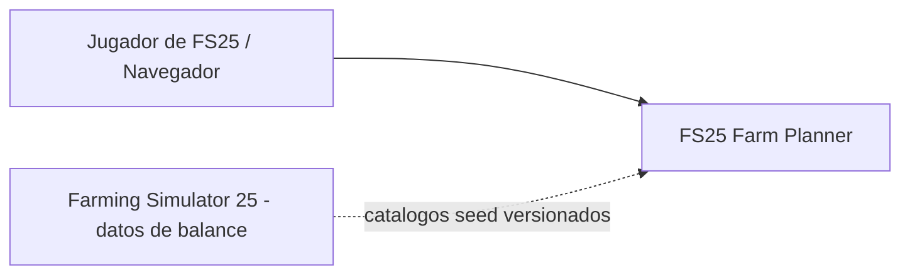
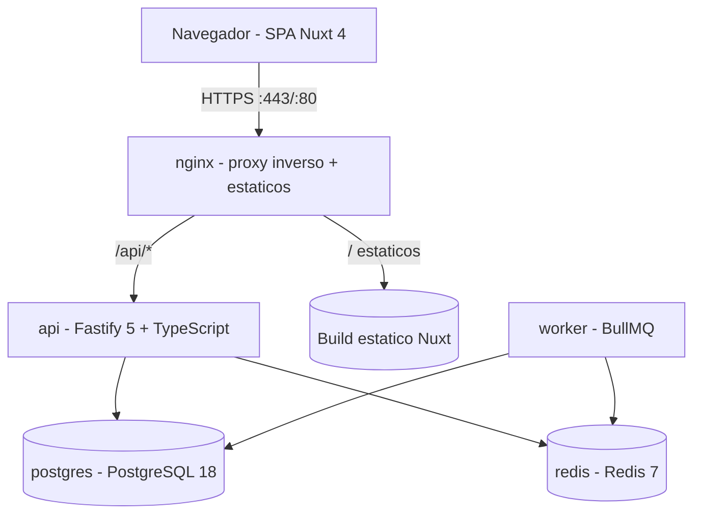
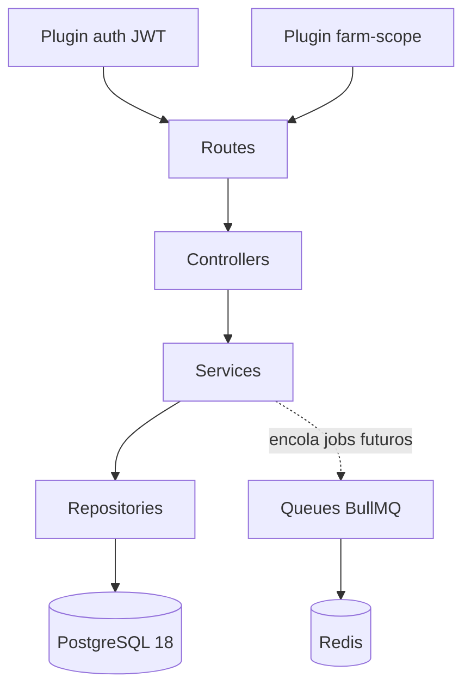

# Arquitectura del Proyecto – FS25 Farm Planner API

## 1. Información General

**Proyecto:** FS25 Farm Planner API

**Versión del Documento:** 1.0

**Fecha:** 2026-06-11

**Responsables:** Equipo FS25 Tools

**Descripción General**
Este documento describe la arquitectura técnica del backend de **FS25 Farm Planner**, la API REST que sustituye la persistencia IndexedDB del prototipo (`planner/`) por un servicio multiusuario con PostgreSQL. Incluye sus decisiones de diseño, estructura de componentes, flujos principales y estándares de desarrollo. El objetivo es servir como referencia corporativa para equipos técnicos, stakeholders y auditorías futuras.

---

## 2. Alcance del Documento

Este documento cubre:
- Arquitectura de software a nivel sistema del backend (API + worker + infraestructura Docker)
- Principales decisiones arquitectónicas (ADR)
- Estructura del proyecto y convenciones
- Patrones de diseño y principios técnicos

Fuera de alcance:
- Detalles de implementación específicos de bajo nivel
- Arquitectura del frontend (ver `docs/arquitectura-frontend.md`)
- Modelo de datos detallado (ver `docs/base-de-datos.md`)
- Modelo de autorización detallado (ver `docs/autorizacion-api.md`)
- Contrato completo de la API (ver `docs/openapi.yaml`)

---

## 3. Contexto del Sistema (C4 – Nivel 1)

### 3.1 Descripción

FS25 Farm Planner es una herramienta de planificación y toma de decisiones para jugadores de Farming Simulator 25. Cada usuario registra sus partidas (granjas), campos, establos y maquinaria; la aplicación calcula proyecciones de cosecha, ingresos y producción animal a partir de catálogos de datos del juego mantenidos en el servidor.

El sistema lo usan jugadores a través de un navegador web. No existen integraciones con sistemas externos en v1: el único "sistema externo" conceptual es el propio juego FS25, cuyos datos de balance (rendimientos, precios, tasas de animales) se incorporan al sistema como catálogos seed versionados.

### 3.2 Diagrama de Contexto



---

## 4. Contenedores del Sistema (C4 – Nivel 2)

### 4.1 Descripción de Contenedores

Todo el sistema se despliega con **Docker Compose** detrás de un proxy inverso nginx. Solo nginx expone puertos al exterior; el resto de contenedores se comunican por una red interna de Docker.

| Contenedor | Tecnología | Responsabilidad |
|-----------|------------|-----------------|
| `nginx` | nginx (alpine) | Proxy inverso. Sirve los estáticos del build del frontend Nuxt y reenvía `/api/*` a la API. Terminación TLS (cuando aplique), compresión, cabeceras de seguridad |
| `api` | Node.js 22 + Fastify 5 + TypeScript | API REST `/api/v1`: autenticación JWT, CRUD de dominio, catálogos. Sirve además la documentación Swagger del contrato |
| `worker` | Node.js 22 + BullMQ + TypeScript | Procesador de jobs en background. **Infraestructura preparada, sin jobs de negocio en v1** (ver ADR-007) |
| `postgres` | PostgreSQL 18 | Persistencia de datos. PKs `uuid` generadas con `uuidv7()` nativo |
| `redis` | Redis 7 | Broker de colas para BullMQ (y cache futura si hiciera falta) |

Notas de despliegue:
- Volúmenes persistentes para `postgres` (datos) y `redis` (AOF opcional).
- Healthchecks en compose: `postgres` (`pg_isready`), `redis` (`PING`), `api` (`GET /api/v1/health`); `nginx` depende de `api` healthy.
- El frontend no es un contenedor de runtime: su build estático (`nuxt generate`/SPA) se monta/copia en `nginx`.
- Variables de entorno por servicio vía `.env` (no commiteado) con `.env.example` versionado.

### 4.2 Diagrama de Contenedores



---

## 5. Componentes Principales (C4 – Nivel 3)

### 5.1 Organización Lógica

El sistema se organiza siguiendo una arquitectura por capas con separación clara de responsabilidades.

| Capa | Responsabilidad |
|-----|-----------------|
| Routes | Exposición de endpoints, registro de schemas zod (request/response) y permisos requeridos |
| Controllers | Orquestación de requests: extraer input validado, invocar servicios, mapear al envelope de respuesta |
| Services | Lógica de negocio: reglas de dominio (coherencia cultivo↔versión de juego, capacidad de establos, rotación de refresh tokens…) |
| Repositories | Acceso a datos con Drizzle ORM; ninguna query fuera de esta capa |
| Plugins | Transversales Fastify: autenticación JWT, scoping de propiedad (`farm-scope`), rate-limit, manejo de errores |
| Queues | Definición de colas y workers BullMQ (preparado, sin jobs de negocio en v1) |

### 5.2 Diagrama de Componentes



Componentes transversales:
- **Plugin `auth`**: verifica el access token JWT y decora `request.user`. Toda ruta excepto `register/login/refresh/logout` y `health` lo exige (`logout` solo necesita el refresh token del cuerpo, por lo que opera aunque el access haya expirado).
- **Plugin `farm-scope`**: para rutas anidadas bajo `/farms/:farmId`, resuelve la farm verificando `farms.user_id = request.user.id` y decora `request.farm`. Si no existe o no es del usuario → `404`. Centralizado para que sea imposible olvidar el filtrado en un handler (ver `docs/autorizacion-api.md`).
- **Error handler global**: convierte errores de zod en `422 VALIDATION_ERROR`, errores de dominio tipados en su código/estatus, y cualquier otro en `500 INTERNAL_ERROR` sin filtrar detalles internos.

---

## 6. Stack Tecnológico

### 6.1 Tecnologías Principales

- Runtime: Node.js 22 LTS
- Lenguaje: TypeScript (strict)
- Framework: Fastify 5
- Persistencia: PostgreSQL 18 + Drizzle ORM (migraciones con drizzle-kit)
- Mensajería / Cache: Redis 7 + BullMQ (infraestructura preparada)
- Validación: zod + `fastify-type-provider-zod` (un único schema por contrato: valida en runtime y tipa en compile time)
- Auth: `@fastify/jwt` (access tokens) + refresh tokens opacos en BD; hashing de contraseñas con argon2id
- Documentación: `@fastify/swagger` + `@fastify/swagger-ui` exponiendo el contrato (fuente de verdad: `docs/openapi.yaml`)

### 6.2 Herramientas de Soporte

- Testing: Vitest (unitario e integración) + Testcontainers o compose de test para Postgres/Redis reales
- Linting / Formatting: ESLint + Prettier
- Observabilidad: logger estructurado de Fastify (pino) con `requestId`; endpoint `/api/v1/health` para healthchecks de compose/nginx

---

## 7. Estructura del Proyecto

La aplicación vive en dos carpetas independientes en la raíz del repositorio: `api/` (este documento) y `web/` (frontend, ver `docs/arquitectura-frontend.md`). No se usa monorepo con workspaces; los tipos del contrato se derivan en cada lado de sus schemas (zod en API, tipos generados de `openapi.yaml` en el frontend si se desea).

```
api/
├── src/
│   ├── routes/            # Definición de rutas por módulo (auth, catalog, farms, fields, ...)
│   ├── controllers/       # Orquestación request/response
│   ├── services/          # Lógica de negocio
│   ├── repositories/      # Acceso a datos (Drizzle)
│   ├── plugins/           # auth, farm-scope, rate-limit, error-handler
│   ├── schemas/           # Schemas zod (request/response, uniones discriminadas por especie)
│   ├── db/
│   │   ├── schema/        # Schema Drizzle (tablas, enums)
│   │   ├── migrations/    # Migraciones drizzle-kit
│   │   └── seeds/         # Seeds de catálogos (game_versions, crops, animal_types, game_constants)
│   ├── queues/            # Conexión Redis, colas y workers BullMQ (preparado)
│   ├── types/             # Tipos compartidos internos
│   ├── config/            # Carga/validación de env (zod)
│   ├── app.ts             # Construcción de la instancia Fastify (testeable)
│   └── server.ts          # Arranque del servidor
├── tests/
├── Dockerfile             # Multi-stage (build TS → runtime node:22-alpine)
├── drizzle.config.ts
└── package.json

docker/                    # Infraestructura compartida en la raíz del repo
├── docker-compose.yml
├── nginx/
│   └── nginx.conf
└── .env.example
```

---

## 8. Convenciones de API

### 8.1 Convención de URLs

```
/api/v1/{modulo}/{recurso}
```

- Recursos de dominio anidados bajo su partida: `/api/v1/farms/{farmId}/fields/{fieldId}`.
- Identificadores: UUID v7 en todas las rutas.
- Catálogos read-only bajo `/api/v1/catalog/*`.

### 8.2 Estructura de Respuestas

**Respuesta Exitosa**
```json
{
  "data": {},
  "meta": {}
}
```

- Listas paginadas: `meta.pagination = { "page": 1, "perPage": 50, "total": 123 }` (por defecto `page=1`, `perPage=50`, máximo 200). En v1 solo **`GET /farms`** pagina; las listas anidadas (fields, stables, machinery, animal-configs) van acotadas por farm y se devuelven completas sin `meta.pagination`.
- Avisos no fatales (p. ej. cultivos remapeados al cambiar versión de juego): `meta.warnings = [...]`.

**Respuesta de Error**
```json
{
  "error": {
    "code": "ERROR_CODE",
    "message": "Descripción del error",
    "details": {}
  }
}
```

- `code` es un identificador estable en MAYÚSCULAS (p. ej. `FIELD_NOT_FOUND`, `DUPLICATE_FIELD_NUMBER`, `CROP_VERSION_MISMATCH`).
- En errores de validación, `details` lleva la lista de issues: `[{ "path": "hectares", "message": "must be > 0" }]`.

---

## 9. Seguridad

- Autenticación: JWT
  - **Access token** JWT firmado, vida ~15 minutos, en cabecera `Authorization: Bearer <token>`. Expirado → `401` con código `TOKEN_EXPIRED` (señal de refresco para el cliente).
  - **Refresh token** opaco (32 bytes aleatorios), vida ~30 días, almacenado solo como hash SHA-256 en `refresh_tokens`. Rotación en cada uso con detección de reuso: si llega un token ya rotado, se revoca toda la cadena (`replaced_by_id`) y se responde `401 REFRESH_TOKEN_REUSED`.
- Contraseñas: argon2id.
- Autorización: por propiedad (ownership), **sin roles** en v1. Cada usuario solo accede a sus recursos; el acceso a recursos ajenos responde `404` (no `403`) para no revelar existencia. Detallado en `docs/autorizacion-api.md`.
- Rate limiting (`@fastify/rate-limit`) en `/auth/login` y `/auth/register` → `429 RATE_LIMITED`.
- Principio de mínimo privilegio aplicado: la red interna de Docker no expone Postgres/Redis al exterior; usuario de BD sin privilegios de superusuario; nginx añade cabeceras de seguridad (`X-Content-Type-Options`, `X-Frame-Options`, CSP del frontend).

---

## 10. Manejo de Errores

| Código | Significado |
|------|-------------|
| 400 | Bad Request (JSON malformado, parámetros ilegibles) |
| 401 | Unauthorized (`TOKEN_EXPIRED`, `INVALID_CREDENTIALS`, `INVALID_REFRESH_TOKEN`, `REFRESH_TOKEN_REUSED`) |
| 403 | Forbidden — **no se usa en v1** (ownership responde 404; reservado para un futuro con roles) |
| 404 | Not Found (`*_NOT_FOUND`, incluye recursos de otros usuarios) |
| 409 | Conflict (`EMAIL_ALREADY_REGISTERED`, `DUPLICATE_FARM_NAME`, `DUPLICATE_FIELD_NUMBER`, `DUPLICATE_STABLE_NAME`) |
| 422 | Validation Error (`VALIDATION_ERROR`, `CROP_VERSION_MISMATCH`, `COUNT_EXCEEDS_CAPACITY`, `FARM_NOT_OWNED`) |
| 429 | Rate Limited (`RATE_LIMITED`) |
| 500 | Internal Server Error (`INTERNAL_ERROR`, sin detalles internos en la respuesta) |

---

## 11. Principios Arquitectónicos

- Separación de responsabilidades: routes → controllers → services → repositories; queries solo en repositorios.
- Contrato primero: `docs/openapi.yaml` es la fuente de verdad del contrato; los schemas zod lo materializan en runtime.
- Seguridad por defecto: todo endpoint requiere auth salvo lista blanca explícita; scoping de propiedad centralizado en plugin, no en cada handler.
- Datos del juego como datos, no como código: catálogos en BD, versionados por `game_versions`, actualizables ante parches de balance sin redesplegar.
- Observabilidad desde el diseño: logs estructurados con `requestId`, healthcheck para orquestación.
- Escalabilidad y mantenibilidad: API stateless (estado solo en Postgres/Redis), lista para replicar el contenedor `api` tras nginx si hiciera falta.

---

## 12. Architecture Decision Records (ADR)

Las decisiones arquitectónicas relevantes deben documentarse siguiendo el formato ADR.

### 12.1 Formato ADR

| Campo | Descripción |
|-----|------------|
| ID | ADR-XXX |
| Fecha | YYYY-MM-DD |
| Estado | Propuesto / Aceptado / Deprecado |
| Contexto | Situación que motiva la decisión |
| Decisión | Decisión tomada |
| Consecuencias | Impactos positivos y negativos |

### 12.2 Registro de ADRs

| ID | Fecha | Estado | Decisión |
|----|-------|--------|----------|
| ADR-001 | 2026-06-11 | Aceptado | Entidad agrupadora `farms` (partida de FS25) |
| ADR-002 | 2026-06-11 | Aceptado | Motor de cálculo en el frontend; la API solo persiste y sirve catálogos |
| ADR-003 | 2026-06-11 | Aceptado | Configs de calculadoras de animales en tabla única con JSONB tipado |
| ADR-004 | 2026-06-11 | Aceptado | Constantes de animales: híbrido columnas + JSONB, y `game_constants` KV versionado |
| ADR-005 | 2026-06-11 | Aceptado | Ownership responde 404 en vez de 403 |
| ADR-006 | 2026-06-11 | Aceptado | Slugs estables en inglés para cultivos; traducción en catálogo (`name_es`) |
| ADR-007 | 2026-06-11 | Aceptado | BullMQ desplegado pero sin jobs de negocio en v1 |
| ADR-008 | 2026-06-11 | Aceptado | PKs `uuid DEFAULT uuidv7()` nativo de PostgreSQL 18 |
| ADR-009 | 2026-06-11 | Aceptado | Multiusuario simple con JWT, sin sistema de roles |
| ADR-010 | 2026-06-11 | Aceptado | Carpetas independientes `api/` y `web/`, sin monorepo |

#### ADR-001 — Entidad agrupadora `farms`

- **Contexto:** En el prototipo, dificultad, yield bonus y tipo de precio de venta son settings globales del navegador. En FS25 esas propiedades pertenecen al *savegame*: un jugador con dos partidas (p. ej. Easy en Riverbend y Hard en Zielonka) no puede compartirlas.
- **Decisión:** Introducir la entidad `farms` (partida). Todos los recursos de juego (fields, stables, machinery, configs de calculadora) cuelgan de `farms`; `farms` cuelga de `users`. Los antiguos `app_settings`/`global_settings` pasan a ser columnas de `farms`.
- **Consecuencias:** (+) Soporta múltiples partidas por usuario desde el día uno; añadirlo después obligaría a migrar todas las FKs. (+) Rutas naturales `/farms/:farmId/...`. (−) Un nivel extra de anidamiento en API y queries.

#### ADR-002 — Cálculos en el frontend

- **Contexto:** El motor de cálculo (`cropCalculations.ts`, `animalCalculations.ts`) alimenta sliders e inputs reactivos; la UX del prototipo depende de resultados instantáneos. Al no haber paquete compartido entre `api/` y `web/` (ADR-010), duplicar las fórmulas en backend crearía divergencia silenciosa.
- **Decisión:** El motor vive solo en el frontend (`web/app/shared/lib/engine`), parametrizado para recibir el catálogo desde la API en vez de constantes hardcodeadas. La API solo persiste datos y sirve catálogos.
- **Consecuencias:** (+) UX reactiva sin latencia ni tráfico; una sola implementación de fórmulas. (−) El backend no puede producir proyecciones de forma autoritativa; cuando existan jobs/informes BullMQ que las necesiten, habrá que extraer el motor a un paquete publicable o exponer endpoints de cálculo (evolución prevista, no v1).

#### ADR-003 — Tabla única `animal_calculator_configs` con JSONB

- **Contexto:** Las 7 especies comparten ~60% de los inputs de calculadora con variaciones por especie. Modelarlas como 7 tablas produciría clones con mantenimiento séptuple; nunca se consulta por un campo interno del input en SQL: se lee/escribe el bloque completo por (farm, especie).
- **Decisión:** Tabla única con `species` (enum), `inputs jsonb` validado en la API mediante unión discriminada zod por especie, y `schema_version` para evolucionar el shape sin migración SQL.
- **Consecuencias:** (+) Un solo CRUD, validación fuerte en el borde, evolución barata. (−) Sin constraints SQL sobre el interior del JSONB; la validación zod es obligatoria e innegociable.

#### ADR-004 — Constantes de animales: híbrido columnas + JSONB

- **Contexto:** Parte de los datos de animales es uniforme entre especies (escalares de dificultad, precio de venta, producto principal); otra parte es heterogénea por especie (tasas mensuales, opciones de alimentación, ratios TMR) y el motor la consume como bloque atómico. En columnas exigiría ~30 columnas mayoritariamente NULL o un modelo EAV.
- **Decisión:** `animal_types` con columnas para lo uniforme y JSONB (`monthly_rates`, `feed_options`) para lo heterogéneo; constantes globales no ligadas a especie en `game_constants` (KV JSONB versionado por `game_versions`).
- **Consecuencias:** (+) Modelo compacto, consultas simples, seed validado con zod. (−) El contenido JSONB se documenta en OpenAPI/BD pero no lo garantiza el motor SQL.

#### ADR-005 — Ownership responde 404

- **Contexto:** Sin roles, un `403` ante un recurso ajeno revela que el recurso existe (enumeración de UUIDs/recursos).
- **Decisión:** Acceder a un recurso de otro usuario devuelve `404 *_NOT_FOUND`, indistinguible de un recurso inexistente. `403` queda reservado para un futuro con roles.
- **Consecuencias:** (+) No se filtra existencia de datos ajenos. (−) Depuración menos directa (mitigado con logs internos que sí distinguen ambos casos).

#### ADR-006 — Slugs estables para cultivos

- **Contexto:** El prototipo identifica cultivos por su nombre en español y mantiene un mapa de traducción ad hoc (`cropTranslationMap`), frágil ante renombrados.
- **Decisión:** La BD y la API identifican cultivos por `slug` estable en inglés (`wheat`, `barley`, `poplar`); el catálogo lleva `name_es`/`name_en` y el frontend traduce.
- **Consecuencias:** (+) Identificadores estables entre versiones de juego e idiomas; el remapeo al cambiar `game_version` se hace por slug.

#### ADR-007 — BullMQ preparado sin jobs

- **Contexto:** Se prevén trabajos asíncronos (informes, limpieza), pero no forman parte del alcance v1. Añadir Redis/worker después tocaría compose, configuración y arranque.
- **Decisión:** Desplegar Redis y el contenedor `worker` con la conexión, una cola base y el esqueleto de procesador desde v1, sin jobs de negocio. Único job opcional permitido: limpieza periódica de `refresh_tokens` expirados.
- **Consecuencias:** (+) Añadir el primer job real es solo código de aplicación. (−) Dos contenedores extra en runtime con uso casi nulo en v1.

#### ADR-008 — UUID v7 nativo

- **Contexto:** Se necesitan IDs únicos no enumerables y amigables con índices B-tree (ordenables por tiempo). PostgreSQL 18 incluye `uuidv7()` nativo.
- **Decisión:** Todas las PKs son `uuid PRIMARY KEY DEFAULT uuidv7()`, generadas en la base de datos.
- **Consecuencias:** (+) Inserción ordenada (menos fragmentación de índice), sin extensión externa ni generación en aplicación. (−) Acopla el despliegue a PostgreSQL ≥ 18.

#### ADR-009 — Multiusuario simple sin roles

- **Contexto:** La aplicación es una herramienta personal de planificación; no hay flujos de administración delegada ni colaboración entre usuarios en v1.
- **Decisión:** Registro/login con JWT y autorización exclusivamente por propiedad. No hay tablas `roles`/`permissions` ni concepto de admin en la API (los catálogos se gestionan por seeds de migración).
- **Consecuencias:** (+) Superficie de seguridad mínima y simple de auditar. (−) Si algún día hay administración de catálogos vía API o colaboración, habrá que introducir roles (el documento de autorización deja indicado el camino).

#### ADR-010 — Carpetas independientes `api/` y `web/`

- **Contexto:** Decisión explícita de organización: dos proyectos separados, cada uno con su `package.json`, sin workspaces compartidos.
- **Decisión:** `api/` y `web/` independientes; los tipos del contrato se duplican donde haga falta (o se generan de `openapi.yaml` en el frontend).
- **Consecuencias:** (+) Builds, despliegues y dependencias desacoplados; simplicidad de tooling. (−) Sin paquete compartido: el motor de cálculo no puede compartirse entre front y back (origen de ADR-002), y el contrato exige disciplina (OpenAPI como fuente de verdad).

---

## 13. Notas y Consideraciones Finales

- **Migración desde el prototipo:** se prevé una utilidad de export desde IndexedDB e import contra la API normal (resolviendo nombres de cultivo en español → slug). Detallada en `docs/plan-implementacion.md` (historia H8).
- **Coherencia cultivo ↔ versión de juego:** la FK `fields.crop_id → crops.id` no garantiza que el cultivo pertenezca a la `game_version` de la farm; se valida en la capa de servicio (`422 CROP_VERSION_MISMATCH`) y el cambio de versión de una farm remapea cultivos por slug dentro de una transacción (detalles en `docs/base-de-datos.md`).
- **Precisión numérica:** la BD usa `numeric`, pero el motor de cálculo opera con `number` de JavaScript (floats). Aceptable para proyecciones de juego; los tests comparan con tolerancias, nunca igualdad estricta.
- **Cache de catálogos:** los catálogos son inmutables por versión → `Cache-Control: public, max-age=86400` + `ETag` por versión de juego; abarata el arranque del frontend, que necesita el catálogo completo para el motor de cálculo.
- **Documentos relacionados:** `docs/arquitectura-frontend.md`, `docs/base-de-datos.md`, `docs/autorizacion-api.md`, `docs/openapi.yaml`, `docs/seeds-catalogo.md`, `docs/plan-implementacion.md`.
