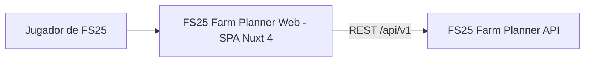
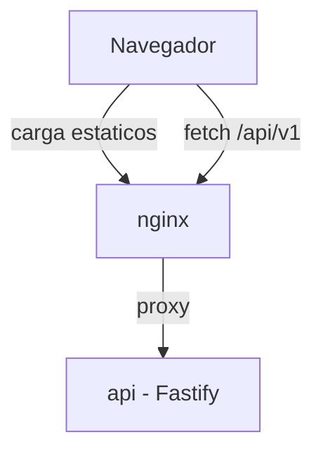
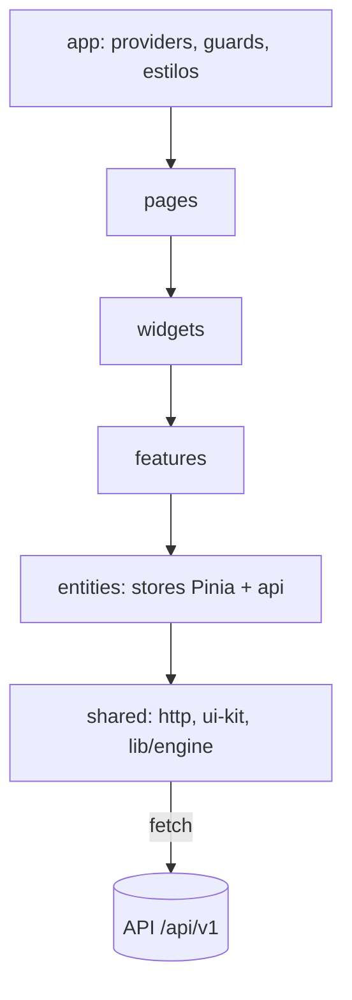

# Arquitectura del Proyecto – FS25 Farm Planner Web

## 1. Información General

**Proyecto:** FS25 Farm Planner Web (frontend)

**Versión del Documento:** 1.0

**Fecha:** 2026-06-11

**Responsables:** Equipo FS25 Tools

**Descripción General**
Este documento describe la arquitectura técnica del frontend de **FS25 Farm Planner**: la evolución del prototipo SPA (`planner/`) a una aplicación Nuxt 4 estructurada con Feature-Sliced Design (FSD), estado con Pinia, estilos con Sass y persistencia contra la API REST (sustituyendo IndexedDB). El objetivo es servir como referencia corporativa para equipos técnicos, stakeholders y auditorías futuras.

---

## 2. Alcance del Documento

Este documento cubre:
- Arquitectura del frontend a nivel sistema
- Principales decisiones arquitectónicas (ADR)
- Estructura del proyecto (FSD) y convenciones
- Patrones de diseño y principios técnicos, incluido el mapeo prototipo → nueva estructura

Fuera de alcance:
- Detalles de implementación de bajo nivel (componentes concretos)
- Arquitectura del backend (ver `docs/arquitectura-api.md`)
- Contrato de la API (ver `docs/openapi.yaml`)

---

## 3. Contexto del Sistema (C4 – Nivel 1)

### 3.1 Descripción

El frontend es una SPA que consume la API de FS25 Farm Planner. Tras autenticarse, el usuario trabaja siempre sobre una **partida activa** (farm): gestiona campos, establos y maquinaria, y usa las calculadoras (cultivos, 7 especies de animales, tiempo de trabajo). Todos los cálculos de proyección se ejecutan en el cliente con el **motor de cálculo** portado del prototipo, alimentado por los catálogos del juego que sirve la API (ADR-002 del documento de API).

### 3.2 Diagrama de Contexto



---

## 4. Contenedores del Sistema (C4 – Nivel 2)

### 4.1 Descripción de Contenedores

El frontend no tiene contenedor de runtime propio: el build estático se sirve desde nginx (ver topología completa en `docs/arquitectura-api.md`, sección 4).

| Contenedor | Tecnología | Responsabilidad |
|-----------|------------|-----------------|
| Navegador (SPA) | Nuxt 4 (`ssr: false`), Vue 3, Pinia, Sass | UI, estado de sesión, motor de cálculo, llamadas a la API |
| `nginx` | nginx (alpine) | Sirve el build estático del frontend y proxy `/api/*` hacia la API |

### 4.2 Diagrama de Contenedores



---

## 5. Componentes Principales (C4 – Nivel 3)

### 5.1 Organización Lógica

El frontend sigue **Feature-Sliced Design**. Las capas, de arriba abajo (cada capa solo importa de capas inferiores):

| Capa | Responsabilidad |
|-----|-----------------|
| `app` | Inicialización: config Nuxt/plugins, providers (Pinia), router guards de auth, estilos globales SCSS |
| `pages` | Composición de rutas; sin lógica de negocio, solo ensamblan widgets/features |
| `widgets` | Bloques de UI autosuficientes (sidebar de navegación, tabla comparativa de cultivos, paneles de calculadora, resúmenes consolidados) |
| `features` | Interacciones con valor de usuario (login, crear/editar campo, asignar cultivo, vincular establo, selector de partida activa) |
| `entities` | Modelos de dominio: tipos, stores Pinia y api-clients por entidad (user, farm, field, stable, machinery, catalog) |
| `shared` | Código sin dominio: cliente HTTP base, ui-kit, helpers, **motor de cálculo** (`shared/lib/engine`) |

### 5.2 Diagrama de Componentes



Componentes transversales clave:
- **Cliente HTTP (`shared/api`)**: wrapper de `$fetch`/`ofetch` que añade `Authorization`, desenvuelve el envelope `{data, meta}`, normaliza errores `{error: {code, message, details}}` y, ante `401 TOKEN_EXPIRED`, ejecuta el refresh y reintenta una vez (cola de peticiones en vuelo durante el refresh).
- **Motor de cálculo (`shared/lib/engine`)**: port de `cropCalculations.ts` y `animalCalculations.ts` del prototipo, **parametrizado**: recibe catálogo (`crops`, `silageCrops`, `animalTypes`, `constants`) y contexto de la farm (difficulty, yieldBonus, sellPriceType) como argumentos en lugar de importar constantes. Funciones puras, testeables sin red.
- **Guard de autenticación**: middleware de router que exige sesión para todo excepto `/login` y `/register`, y redirige según estado.

---

## 6. Stack Tecnológico

### 6.1 Tecnologías Principales

- Runtime: Navegador (SPA estática; Node 22 solo para build)
- Lenguaje: TypeScript (strict)
- Framework: Nuxt 4 (`ssr: false`) + Vue 3 (`<script setup>`)
- Estado: Pinia (`@pinia/nuxt`)
- Estilos: Sass (SCSS) — migración del CSS glassmorphism actual a variables, mixins y partials SCSS
- Persistencia: API REST `/api/v1` (sustituye IndexedDB del prototipo)

### 6.2 Herramientas de Soporte

- Testing: Vitest + @vue/test-utils (unitario de engine y stores; componentes clave)
- Linting / Formatting: ESLint + Prettier; `@feature-sliced/steiger` o reglas de import para vigilar dependencias entre capas FSD
- Observabilidad: manejo centralizado de errores de API con notificación al usuario; logs de consola solo en dev

---

## 7. Estructura del Proyecto

```
web/
├── app/
│   ├── app.vue
│   ├── app/                      # Capa FSD "app"
│   │   ├── providers/            # Pinia, plugins
│   │   ├── router/               # middleware de auth
│   │   └── styles/               # SCSS global: _variables.scss, _mixins.scss, main.scss
│   ├── pages/                    # Capa "pages" (rutas Nuxt)
│   │   ├── index.vue             # Dashboard
│   │   ├── login.vue
│   │   ├── register.vue
│   │   ├── fields.vue
│   │   ├── stables.vue
│   │   ├── machinery.vue
│   │   ├── speed-calculator.vue
│   │   └── animals/
│   │       ├── cows.vue … horses.vue   # 7 calculadoras
│   ├── widgets/
│   │   ├── app-sidebar/
│   │   ├── crop-comparison-table/
│   │   ├── farm-summary/         # resúmenes consolidados (dashboard, stables)
│   │   └── animal-calculator-panels/   # paneles inputs/producción/fieldwork
│   ├── features/
│   │   ├── auth/                 # login, register, logout
│   │   ├── farm-switcher/        # selector y CRUD de partidas
│   │   ├── field-manage/         # crear/editar/borrar campo, asignar cultivo
│   │   ├── stable-manage/
│   │   ├── machinery-manage/
│   │   └── calculator-config/    # guardar/cargar configs de calculadoras
│   ├── entities/
│   │   ├── user/                 # store sesión + api auth
│   │   ├── farm/                 # store farm activa + api farms
│   │   ├── field/
│   │   ├── stable/
│   │   ├── machinery/
│   │   └── catalog/              # store catálogo cacheado + api catalog
│   └── shared/
│       ├── api/                  # cliente HTTP base, tipos del contrato
│       ├── ui/                   # ui-kit: GlassCard, StatCard, DataTable, inputs…
│       ├── lib/
│       │   └── engine/           # motor de cálculo portado (crops + animals)
│       └── config/
├── public/
├── nuxt.config.ts
├── Dockerfile                    # build estático → artefacto para nginx
└── package.json
```

Nota Nuxt 4 + FSD: `pages/` debe seguir siendo el directorio de rutas de Nuxt; el resto de capas se aliasan en `nuxt.config.ts` (p. ej. `~/widgets`, `~/features`) y se registran `components: false` o auto-import dirigido para no romper la disciplina de imports de FSD.

---

## 8. Convenciones de API

### 8.1 Convención de URLs

El frontend consume exclusivamente:

```
/api/v1/{modulo}/{recurso}
```

vía el cliente de `shared/api` (nunca `$fetch` directo en componentes). La base URL es relativa (`/api/v1`) porque nginx hace el proxy — sin CORS en producción; en dev se usa el proxy de Nuxt (`nitro.devProxy`) hacia la API local.

### 8.2 Estructura de Respuestas

El cliente HTTP desenvuelve el envelope del backend:

**Respuesta Exitosa**
```json
{
  "data": {},
  "meta": {}
}
```

**Respuesta de Error**
```json
{
  "error": {
    "code": "ERROR_CODE",
    "message": "Descripción del error",
    "details": {}
  }
}
```

Reglas en el cliente:
- `code` se mapea a mensajes localizados (es) para el usuario; `message` del backend es para desarrolladores.
- `422 VALIDATION_ERROR` → `details` se vuelca a errores por campo en formularios.
- `401 TOKEN_EXPIRED` → refresh automático y reintento (una vez); si el refresh falla → logout y redirección a `/login`.
- Tokens: access token en memoria (store Pinia), refresh token en `localStorage` (asumido: SPA sin SSR; documentado como trade-off frente a cookies httpOnly en ADR-F03).

---

## 9. Seguridad

- Autenticación: JWT contra `/api/v1/auth/*` (access ~15 min en memoria + refresh rotado).
- Autorización: la API aplica ownership (ver `docs/autorizacion-api.md`); el frontend no implementa permisos, solo guards de "autenticado / no autenticado".
- Principio de mínimo privilegio aplicado: el cliente nunca construye queries ni conoce IDs ajenos; los catálogos son read-only.
- Sanitización: no se renderiza HTML proveniente de la API; CSP servida por nginx.

---

## 10. Manejo de Errores

| Código | Significado (tratamiento en el frontend) |
|------|-------------|
| 400 | Bad Request — error de programación del cliente; log + mensaje genérico |
| 401 | Unauthorized — `TOKEN_EXPIRED`: refresh + retry; resto: logout |
| 403 | Forbidden — no esperado en v1 (la API usa 404 para ownership) |
| 404 | Not Found — recurso inexistente o ajeno; navegación a listado + aviso |
| 422 | Validation Error — errores por campo en el formulario correspondiente |
| 429 | Rate Limited — aviso "demasiados intentos" en login/registro |
| 500 | Internal Server Error — mensaje genérico + opción de reintentar |

---

## 11. Principios Arquitectónicos

- FSD estricto: dependencias solo hacia capas inferiores; slices no se importan entre sí dentro de la misma capa (salvo vía API pública `index.ts` del slice).
- Funciones puras para el dominio calculado: el motor de cálculo no toca stores ni red; los componentes lo invocan con datos de stores.
- Una fuente de verdad por dato: catálogo y farm activa viven en stores Pinia; los componentes no duplican estado del servidor.
- Estilos sistematizados: tokens de diseño (colores, sombras, radios del tema glassmorphism actual) como variables/mixins SCSS en `app/styles`, consumidos por el ui-kit de `shared/ui`.
- Contrato primero: tipos del contrato derivados de `docs/openapi.yaml` (generación de tipos) o replicados con disciplina en `shared/api`.

---

## 12. Architecture Decision Records (ADR)

### 12.1 Formato ADR

| Campo | Descripción |
|-----|------------|
| ID | ADR-FXX |
| Fecha | YYYY-MM-DD |
| Estado | Propuesto / Aceptado / Deprecado |
| Contexto | Situación que motiva la decisión |
| Decisión | Decisión tomada |
| Consecuencias | Impactos positivos y negativos |

### 12.2 Registro de ADRs

| ID | Fecha | Estado | Decisión |
|----|-------|--------|----------|
| ADR-F01 | 2026-06-11 | Aceptado | SPA (`ssr: false`) servida como estático por nginx |
| ADR-F02 | 2026-06-11 | Aceptado | Feature-Sliced Design sobre Nuxt 4 |
| ADR-F03 | 2026-06-11 | Aceptado | Access token en memoria + refresh token en localStorage |
| ADR-F04 | 2026-06-11 | Aceptado | Motor de cálculo en `shared/lib/engine` parametrizado por catálogo |
| ADR-F05 | 2026-06-11 | Aceptado | Sass (SCSS) con tokens de diseño; migración del CSS actual |
| ADR-F06 | 2026-06-11 | Aceptado | Pinia como única gestión de estado |

#### ADR-F01 — SPA estática
- **Contexto:** El prototipo ya es `ssr: false` (dependía de IndexedDB); la aplicación es una herramienta privada tras login, sin necesidades SEO.
- **Decisión:** Mantener SPA; el build se sirve desde nginx, que también hace proxy de `/api`.
- **Consecuencias:** (+) Despliegue trivial (estáticos), sin servidor Node en runtime, sin CORS. (−) Sin SSR/SEO (irrelevante tras login).

#### ADR-F02 — Feature-Sliced Design
- **Contexto:** El prototipo concentra lógica en páginas monolíticas (`fields.vue`, calculadoras) con utils globales; escalar así degrada mantenibilidad.
- **Decisión:** Adoptar FSD con las capas de la sección 5.1, integrándolo con el sistema de rutas de Nuxt (solo `pages/` es de Nuxt; el resto, alias).
- **Consecuencias:** (+) Límites de dependencia explícitos, slices testables. (−) Fricción con auto-imports de Nuxt; requiere configuración y linting de capas.

#### ADR-F03 — Tokens: memoria + localStorage
- **Contexto:** SPA sin SSR; las cookies httpOnly exigirían que la API gestionara cookies y CSRF.
- **Decisión:** Access token solo en memoria (store Pinia); refresh token en `localStorage`. Rotación y detección de reuso en el backend mitigan el robo de refresh.
- **Consecuencias:** (+) Simplicidad, sin CSRF. (−) El refresh token es accesible ante XSS — mitigado con CSP estricta, sin renderizado de HTML externo, y rotación con revocación de cadena en backend.

#### ADR-F04 — Motor de cálculo parametrizado en el cliente
- **Contexto:** Decisión global ADR-002 (documento de API): los cálculos viven en el frontend; las constantes del juego ahora llegan por la API.
- **Decisión:** Portar `cropCalculations.ts`/`animalCalculations.ts` a `shared/lib/engine` como funciones puras `f(catálogo, contextoFarm, inputs) → resultados`, eliminando imports de constantes y el `cropTranslationMap` (la API entrega slugs + `name_es`).
- **Consecuencias:** (+) Reactividad instantánea; tests unitarios del motor sin red; un solo lugar para las fórmulas. (−) Si el backend necesita calcular en el futuro, habrá que extraer el motor (asumido en ADR-002).

#### ADR-F05 — Sass con tokens de diseño
- **Contexto:** El prototipo define el tema glassmorphism en un único `main.css` con variables CSS.
- **Decisión:** Migrar a SCSS: `_variables.scss` (tokens: colores `#2ed573`/`#ffa502`, fondos, sombras, radios), `_mixins.scss` (glass-card, focus, breakpoints), partials por capa; las variables CSS de runtime se conservan para theming, generadas desde SCSS.
- **Consecuencias:** (+) Reutilización y consistencia del ui-kit. (−) Pipeline de estilos adicional (mínimo: Nuxt soporta Sass de serie con `sass` instalado).

#### ADR-F06 — Pinia
- **Contexto:** El prototipo usa `useState` de Nuxt + lecturas directas a IndexedDB repartidas por páginas.
- **Decisión:** Pinia como única gestión de estado: stores por entidad (`session`, `farm`, `catalog`, `fields`, `stables`, `machinery`) con acciones async que llaman al api-client del slice.
- **Consecuencias:** (+) Estado tipado, devtools, testabilidad. (−) Disciplina necesaria para no duplicar estado servidor.

---

## 13. Notas y Consideraciones Finales

### Mapeo prototipo → nueva estructura

| Prototipo (`planner/`) | Destino en `web/` |
|---|---|
| `app/composables/useDB.ts` (IndexedDB) | **Desaparece** → api-clients por entidad sobre `shared/api` |
| `app/composables/useGlobalSettings.ts` | `entities/farm` (difficulty, yieldBonus, sellPriceType son de la farm activa) + `entities/user` (preferencias UI vía `/me/settings`) |
| `app/utils/cropData.ts`, `animalData.ts` | **Desaparecen** → catálogo servido por `/api/v1/catalog/*`, cacheado en `entities/catalog` |
| `app/utils/cropCalculations.ts`, `animalCalculations.ts` | `shared/lib/engine` (parametrizados, ADR-F04) |
| `app/pages/index.vue` (dashboard) | `pages/index.vue` + `widgets/farm-summary` |
| `app/pages/fields.vue` | `pages/fields.vue` + `widgets/crop-comparison-table` + `features/field-manage` + `entities/field` |
| `app/pages/stables.vue` | `pages/stables.vue` + `features/stable-manage` + `entities/stable` |
| `app/pages/machinery.vue` | `pages/machinery.vue` + `features/machinery-manage` + `entities/machinery` |
| `app/pages/speed-calculator.vue` | `pages/speed-calculator.vue` + estado persistido en `/farms/:id/calculator-states/work_speed` (máquinas referenciadas por UUID, no por nombre) |
| `app/pages/animals/*.vue` (7 páginas) | `pages/animals/*` + `widgets/animal-calculator-panels` + `features/calculator-config` (persistencia en `/farms/:id/animal-configs/:species`) |
| `app/layouts/default.vue` (sidebar) | `widgets/app-sidebar` + layout Nuxt |
| `app/assets/css/main.css` | `app/styles/*.scss` (ADR-F05) |

- **Novedades sin equivalente en el prototipo:** páginas `login`/`register`, selector de partida (`features/farm-switcher`) y la noción de farm activa (`user_settings.active_farm_id`).
- **Documentos relacionados:** `docs/arquitectura-api.md`, `docs/openapi.yaml`, `docs/seeds-catalogo.md`, `docs/plan-implementacion.md`.
