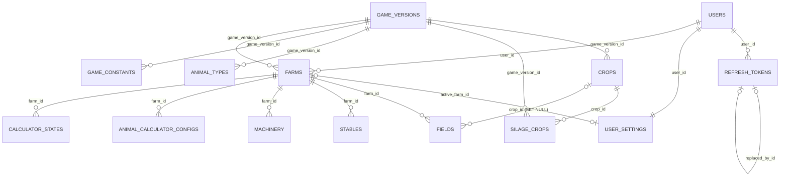

# 📚 Documentación Base de Datos — FS25 Farm Planner

## Modelo de datos del planificador de granjas para Farming Simulator 25: usuarios y sesiones, catálogos versionados del juego (cultivos, animales, constantes) y recursos de partida (campos, establos, maquinaria, configuraciones de calculadoras).

---

## 📋 Información General

### Componentes de Datos

- **Base de datos principal**: PostgreSQL 18 — persistencia de todo el dominio (usuarios, catálogos, partidas)
- **Bases de datos auxiliares**: no aplica
- **Cache / Search / Otros**: Redis 7 — broker de colas BullMQ (no almacena datos de dominio; sin esquema propio)

> Alcance: este documento cubre el esquema completo de PostgreSQL (tablas, enums, índices, constraints y reglas de negocio). Los **valores de los seeds** (cultivos, ensilajes, animales, constantes) viven en `docs/seeds-catalogo.md`. No cubre la configuración operativa de Redis ni el contrato de la API (ver `docs/openapi.yaml`).

---

### PostgreSQL (relacional)

- **Motor**: PostgreSQL 18
- **Encoding**: UTF-8
- **Host**: `postgres` (red interna Docker Compose) / `localhost` en desarrollo
- **Puerto**: 5432 (no expuesto fuera de la red interna en producción)
- **Usuario**: `fs25_planner` (sin privilegios de superusuario)
- **Schema**: `public`
- **Estrategia de IDs**: `uuid PRIMARY KEY DEFAULT uuidv7()` (función nativa de PostgreSQL 18) en todas las tablas

**Nombre de base de datos**:

- `fs25_planner` (desarrollo y producción; instancias separadas por entorno)

---

### Otras Bases de Datos / Servicios

#### Redis

- **Motor**: Redis 7
- **Uso**: colas BullMQ (infraestructura preparada, sin jobs de negocio en v1)
- **Colecciones / Índices clave**:
  - claves `bull:*` gestionadas por BullMQ

---

## 🎯 Propósito del Modelo de Datos

Descripción de los dominios que cubre la base de datos:

- ✅ **Identidad y acceso**: usuarios, sesiones por refresh token con rotación, preferencias de UI
- ✅ **Catálogo del juego (versionado)**: cultivos, cultivos de ensilaje, tipos de animales con sus tasas, y constantes globales de balance de FS25
- ✅ **Dominio de partida**: granjas/partidas del usuario, campos, establos, maquinaria, configuraciones de calculadoras de animales y estados de herramientas

---

## 📊 Estadísticas Generales

```
Total de Tablas: 14
Total de Enums: 3 (difficulty, sell_price_type, animal_species)
Total de Índices: 20 (12 únicos + 1 único parcial + 7 de apoyo)
Total de Relaciones (FK): 17
```

---

## 🗂️ Estructura de Base de Datos

### Fuente de Verdad del Esquema

- **ORM / DDL**: Drizzle ORM — `api/src/db/schema/`
- **Migraciones**: drizzle-kit — `api/src/db/migrations/`
- **Seeds**: `api/src/db/seeds/` (catálogos del juego). **Fuente de verdad de los valores: `docs/seeds-catalogo.md`** (documento autocontenido; ya no depende del prototipo).

Convenciones globales:
- Todas las tablas llevan `created_at timestamptz NOT NULL DEFAULT now()` y `updated_at timestamptz NOT NULL DEFAULT now()`.
- `updated_at` se mantiene con `$onUpdate` de Drizzle **y además** con un trigger común `set_updated_at()` como red de seguridad ante escrituras fuera del ORM (seeds, hotfixes en psql).
- Dinero y cantidades físicas: `numeric`, nunca `float`/`real`.
- Extensión requerida: `citext` (emails case-insensitive).

```sql
-- Enums globales
CREATE TYPE difficulty AS ENUM ('easy', 'normal', 'hard');
CREATE TYPE sell_price_type AS ENUM ('baseline', 'max_seasonal');
CREATE TYPE animal_species AS ENUM ('cow', 'buffalo', 'chicken', 'sheep', 'goat', 'pig', 'horse');

-- Trigger común de updated_at
CREATE FUNCTION set_updated_at() RETURNS trigger AS $$
BEGIN
  NEW.updated_at = now();
  RETURN NEW;
END;
$$ LANGUAGE plpgsql;
-- (se crea un trigger BEFORE UPDATE por tabla)
```

##### difficulty

| Valor | Descripción |
| --------- | ------------------------- |
| `easy` | Dificultad económica fácil — ingresos ×3.0 respecto a hard |
| `normal` | Dificultad normal — ingresos ×1.8 respecto a hard |
| `hard` | Dificultad difícil — multiplicador base ×1.0 |

##### sell_price_type

| Valor | Descripción |
| --------- | ------------------------- |
| `baseline` | Proyecciones con precio base de venta |
| `max_seasonal` | Proyecciones con el precio máximo estacional |

##### animal_species

| Valor | Descripción |
| --------- | ------------------------- |
| `cow` | Vacas (leche) |
| `buffalo` | Búfalos de agua (leche de búfala) |
| `chicken` | Gallinas (huevos) |
| `sheep` | Ovejas (lana) |
| `goat` | Cabras (leche de cabra) |
| `pig` | Cerdos (venta de animales) |
| `horse` | Caballos (venta de animales) |

> Las especies se duplican deliberadamente como enum (en `stables`, `animal_calculator_configs`) y como filas de `animal_types`: la lista de especies es estable entre versiones del juego (cambian sus tasas, no la lista). Si FS25 añadiera una especie: `ALTER TYPE animal_species ADD VALUE ...` + seed.

---

## 🔐 Módulo: Identidad y Acceso

### 1. users

**Descripción**: Cuentas de usuario de la aplicación. Autenticación por email + contraseña (argon2id).

```sql
CREATE TABLE users (
    id            uuid PRIMARY KEY DEFAULT uuidv7(),
    email         citext NOT NULL,
    password_hash text NOT NULL,
    display_name  varchar(100),
    created_at    timestamptz NOT NULL DEFAULT now(),
    updated_at    timestamptz NOT NULL DEFAULT now()
);
```

#### DDL de Índices y Constraints

```sql
ALTER TABLE users ADD CONSTRAINT users_email_unique UNIQUE (email);
ALTER TABLE users ADD CONSTRAINT users_email_format CHECK (email ~* '^[^@\s]+@[^@\s]+\.[^@\s]+$');
```

#### Diccionario de Campos

| Campo | Tipo | Descripción |
| --------- | -------- | ------------------ |
| id | uuid | PK, uuidv7() |
| email | citext | Email único, case-insensitive |
| password_hash | text | Hash argon2id de la contraseña |
| display_name | varchar(100) | Nombre visible opcional |
| created_at / updated_at | timestamptz | Auditoría |

#### Reglas de Negocio

- Contraseña mínima de 8 caracteres (validada en API, no en BD).
- Al registrarse se crean automáticamente su fila de `user_settings` y una farm por defecto ("Mi partida").

---

### 2. refresh_tokens

**Descripción**: Sesiones de refresh con rotación y detección de reuso. Solo se almacena el hash SHA-256 del token opaco; el token en claro nunca toca la BD.

```sql
CREATE TABLE refresh_tokens (
    id             uuid PRIMARY KEY DEFAULT uuidv7(),
    user_id        uuid NOT NULL,
    token_hash     text NOT NULL,
    expires_at     timestamptz NOT NULL,
    revoked_at     timestamptz,
    replaced_by_id uuid,
    user_agent     text,
    ip             inet,
    created_at     timestamptz NOT NULL DEFAULT now(),
    updated_at     timestamptz NOT NULL DEFAULT now()
);
```

#### DDL de Índices y Constraints

```sql
CREATE UNIQUE INDEX refresh_tokens_token_hash_unique ON refresh_tokens(token_hash);
CREATE INDEX idx_refresh_tokens_user_id    ON refresh_tokens(user_id);
CREATE INDEX idx_refresh_tokens_expires_at ON refresh_tokens(expires_at);

ALTER TABLE refresh_tokens ADD CONSTRAINT refresh_tokens_user_fk
  FOREIGN KEY (user_id) REFERENCES users(id) ON DELETE CASCADE;
ALTER TABLE refresh_tokens ADD CONSTRAINT refresh_tokens_replaced_by_fk
  FOREIGN KEY (replaced_by_id) REFERENCES refresh_tokens(id);
```

#### Diccionario de Campos

| Campo | Tipo | Descripción |
| --------- | -------- | ------------------ |
| token_hash | text | SHA-256 del refresh token opaco (32 bytes aleatorios) |
| expires_at | timestamptz | Caducidad (~30 días desde emisión) |
| revoked_at | timestamptz | Momento de revocación (logout o detección de reuso) |
| replaced_by_id | uuid | Token que sustituyó a este en la rotación (cadena) |
| user_agent / ip | text / inet | Metadatos de la sesión para auditoría |

#### Reglas de Negocio

- En cada `/auth/refresh` el token usado se marca rotado (`replaced_by_id`) y se emite uno nuevo.
- Si llega un token ya rotado o revocado → **reuso detectado**: se revoca toda la cadena del usuario y se responde `401 REFRESH_TOKEN_REUSED`.
- `idx_refresh_tokens_expires_at` da soporte a la limpieza periódica de tokens expirados (candidato a primer job real de BullMQ).

---

### 3. user_settings

**Descripción**: Preferencias de UI del usuario (1:1 con `users`). No contiene configuración de juego: eso vive en `farms`.

```sql
CREATE TABLE user_settings (
    user_id        uuid PRIMARY KEY,
    locale         varchar(10) NOT NULL DEFAULT 'es',
    theme          varchar(20) NOT NULL DEFAULT 'system',
    active_farm_id uuid,
    preferences    jsonb NOT NULL DEFAULT '{}',
    created_at     timestamptz NOT NULL DEFAULT now(),
    updated_at     timestamptz NOT NULL DEFAULT now()
);
```

#### DDL de Índices y Constraints

```sql
ALTER TABLE user_settings ADD CONSTRAINT user_settings_user_fk
  FOREIGN KEY (user_id) REFERENCES users(id) ON DELETE CASCADE;
ALTER TABLE user_settings ADD CONSTRAINT user_settings_active_farm_fk
  FOREIGN KEY (active_farm_id) REFERENCES farms(id) ON DELETE SET NULL;
```

#### Diccionario de Campos

| Campo | Tipo | Descripción |
| --------- | -------- | ------------------ |
| user_id | uuid | PK y FK a users (extensión 1:1; excepción consciente a "uuidv7 en todas las PK") |
| locale | varchar(10) | Idioma de la UI (`es` por defecto) |
| theme | varchar(20) | `system` / `dark` / `light` |
| active_farm_id | uuid | Partida activa seleccionada en la UI |
| preferences | jsonb | Preferencias menores de UI (validadas con zod en la API) |

#### Reglas de Negocio

- `active_farm_id` debe pertenecer al propio usuario (`422 FARM_NOT_OWNED`, validación en servicio).
- La fila se crea en el registro; `GET /me/settings` la crea con defaults si faltara.

---

## 🔐 Módulo: Catálogo del Juego (versionado)

### 4. game_versions

**Descripción**: Versiones de balance de FS25. Cada parche relevante = nueva fila + re-seed completo de catálogos para esa versión; las versiones antiguas quedan intactas y las farms que las usan siguen siendo coherentes.

```sql
CREATE TABLE game_versions (
    id          uuid PRIMARY KEY DEFAULT uuidv7(),
    label       varchar(50) NOT NULL,
    is_active   boolean NOT NULL DEFAULT false,
    released_at date,
    created_at  timestamptz NOT NULL DEFAULT now(),
    updated_at  timestamptz NOT NULL DEFAULT now()
);
```

#### DDL de Índices y Constraints

```sql
ALTER TABLE game_versions ADD CONSTRAINT game_versions_label_unique UNIQUE (label);
CREATE UNIQUE INDEX one_active_game_version ON game_versions(is_active) WHERE is_active;
```

#### Diccionario de Campos

| Campo | Tipo | Descripción |
| --------- | -------- | ------------------ |
| label | varchar(50) | Etiqueta legible, p. ej. `FS25 1.7` |
| is_active | boolean | Versión por defecto para nuevas farms y catálogos (solo una activa, índice parcial) |
| released_at | date | Fecha de publicación del parche |

#### Reglas de Negocio

- Los endpoints de catálogo sirven la versión activa salvo `?gameVersionId` explícito.
- No se borran versiones referenciadas (`ON DELETE RESTRICT` desde los catálogos y farms).

---

### 5. crops

**Descripción**: Catálogo de cultivos del juego con sus parámetros de rendimiento y precio. Identificación estable por `slug` en inglés (la UI traduce con `name_es`).

```sql
CREATE TABLE crops (
    id               uuid PRIMARY KEY DEFAULT uuidv7(),
    game_version_id  uuid NOT NULL,
    slug             varchar(50) NOT NULL,
    name_es          varchar(100) NOT NULL,
    name_en          varchar(100) NOT NULL,
    yield_per_m2     numeric(10,4) NOT NULL,
    base_price       numeric(10,4) NOT NULL,
    max_price_factor numeric(6,3)  NOT NULL,
    seed_rate        numeric(12,6) NOT NULL,
    weight_per_liter numeric(6,3)  NOT NULL,
    created_at       timestamptz NOT NULL DEFAULT now(),
    updated_at       timestamptz NOT NULL DEFAULT now()
);
```

#### DDL de Índices y Constraints

```sql
ALTER TABLE crops ADD CONSTRAINT crops_version_slug_unique UNIQUE (game_version_id, slug);
ALTER TABLE crops ADD CONSTRAINT crops_game_version_fk
  FOREIGN KEY (game_version_id) REFERENCES game_versions(id) ON DELETE RESTRICT;
ALTER TABLE crops ADD CONSTRAINT crops_yield_positive       CHECK (yield_per_m2 > 0);
ALTER TABLE crops ADD CONSTRAINT crops_price_non_negative   CHECK (base_price >= 0);
ALTER TABLE crops ADD CONSTRAINT crops_max_factor_positive  CHECK (max_price_factor > 0);
ALTER TABLE crops ADD CONSTRAINT crops_seed_non_negative    CHECK (seed_rate >= 0);
ALTER TABLE crops ADD CONSTRAINT crops_weight_positive      CHECK (weight_per_liter > 0);
```

#### Diccionario de Campos

| Campo | Tipo | Descripción |
| --------- | -------- | ------------------ |
| slug | varchar(50) | Identificador estable en inglés (`wheat`, `poplar`…) |
| name_es / name_en | varchar(100) | Nombres para UI |
| yield_per_m2 | numeric(10,4) | Rendimiento base en L/m² |
| base_price | numeric(10,4) | Precio base de venta $/L |
| max_price_factor | numeric(6,3) | Multiplicador del precio máximo estacional |
| seed_rate | numeric(12,6) | Semilla necesaria en L/m² (rango real: 0.0 uva/oliva … 1.2 caña de azúcar) |
| weight_per_liter | numeric(6,3) | Densidad t/m³ |

#### Reglas de Negocio

- Read-only para usuarios: solo se escribe vía seeds de migración.
- **Seed v1** (25 cultivos; valores completos y JSON en `docs/seeds-catalogo.md` §2):

| slug | name_es | yield_per_m2 | base_price | max_price_factor | seed_rate | weight_per_liter |
|---|---|---|---|---|---|---|
| barley | Cebada | 0.96 | 0.313 | 1.21 | 0.0265 | 0.68 |
| onion | Cebollas | 7.0 | 0.75 | 3.0 | 0.0005 | 1.0 |
| redbeet | Remolacha | 5.78 | 0.122 | 1.15 | 0.004 | 0.52 |
| canola | Canola | 0.58 | 0.603 | 1.21 | 0.0049 | 0.6 |
| carrot | Zanahoria | 7.7 | 0.132 | 1.15 | 0.001 | 0.64 |
| corn | Maíz | 0.92 | 0.38 | 1.33 | 0.0053 | 0.8 |
| cotton | Algodón | 0.497 | 1.252 | 1.11 | 0.005 | 0.23 |
| grape | Uva | 1.84 | 0.603 | 1.2 | 0.0 | 0.6 |
| green_beans | Judías Verdes | 0.6975 | 0.72 | 1.05 | 0.028 | 0.42 |
| oat | Avena | 0.57 | 0.532 | 1.21 | 0.034 | 0.5 |
| olive | Oliva | 1.84 | 0.603 | 1.2 | 0.0 | 0.6 |
| parsnip | Chirivía | 6.95 | 0.131 | 1.15 | 0.001 | 0.58 |
| pea | Guisantes | 0.96 | 1.04 | 1.1 | 0.025 | 0.72 |
| potato | Patatas | 4.13 | 0.222 | 1.15 | 0.3733 | 0.75 |
| rice_long_grain | Arroz (Largo) | 0.9 | 0.53 | 1.05 | 0.05 | 0.77 |
| rice | Arroz (Corto) | 0.66 | 1.1 | 1.05 | 0.015625 | 0.79 |
| sorghum | Sorgo | 0.82 | 0.43 | 1.22 | 0.0035 | 0.85 |
| soybean | Soja | 0.45 | 0.778 | 1.59 | 0.0214 | 0.7 |
| spinach | Espinacas | 2.31 | 0.22 | 1.05 | 0.001 | 0.13 |
| sugarbeet | Remolacha Azucarera | 5.78 | 0.172 | 1.15 | 0.0034 | 0.7 |
| sugarcane | Caña de Azúcar | 11.34 | 0.119 | 1.05 | 1.2 | 0.18 |
| sunflower | Girasol | 0.52 | 0.673 | 1.2 | 0.0143 | 0.35 |
| wheat | Trigo | 0.89 | 0.337 | 1.21 | 0.0308 | 0.78 |
| grass | Hierba | 4.37 | 0.045 | 1.11 | 0.012 | 0.3 |
| poplar | Álamo (Astillas de Madera) | 19.881 | 0.32 | 1.69 | 0.15 | 0.35 |

---

### 6. silage_crops

**Descripción**: Parámetros de ensilaje por cultivo. El rendimiento es **propio, no derivado** del cultivo base (ej.: Álamo ensilaje 6.627 vs cultivo 19.881).

```sql
CREATE TABLE silage_crops (
    id              uuid PRIMARY KEY DEFAULT uuidv7(),
    game_version_id uuid NOT NULL,
    crop_id         uuid NOT NULL,
    yield_per_m2    numeric(10,4) NOT NULL,
    chaff_factor    numeric(6,3)  NOT NULL,
    created_at      timestamptz NOT NULL DEFAULT now(),
    updated_at      timestamptz NOT NULL DEFAULT now()
);
```

#### DDL de Índices y Constraints

```sql
ALTER TABLE silage_crops ADD CONSTRAINT silage_crops_version_crop_unique UNIQUE (game_version_id, crop_id);
ALTER TABLE silage_crops ADD CONSTRAINT silage_crops_game_version_fk
  FOREIGN KEY (game_version_id) REFERENCES game_versions(id) ON DELETE RESTRICT;
ALTER TABLE silage_crops ADD CONSTRAINT silage_crops_crop_fk
  FOREIGN KEY (crop_id) REFERENCES crops(id) ON DELETE CASCADE;
ALTER TABLE silage_crops ADD CONSTRAINT silage_crops_yield_positive CHECK (yield_per_m2 > 0);
ALTER TABLE silage_crops ADD CONSTRAINT silage_crops_chaff_positive CHECK (chaff_factor > 0);
```

#### Diccionario de Campos

| Campo | Tipo | Descripción |
| --------- | -------- | ------------------ |
| crop_id | uuid | Cultivo base (misma versión de juego) |
| yield_per_m2 | numeric(10,4) | Rendimiento en modo ensilaje, L/m² |
| chaff_factor | numeric(6,3) | Multiplicador de chaff (residuo fermentable) |

#### Reglas de Negocio

- **Seed v1** (10 cultivos; valores completos y JSON en `docs/seeds-catalogo.md` §3): barley 0.96/4.0, canola 0.58/4.0, corn 0.92/7.8, oat 0.57/4.0, sorghum 0.82/4.0, soybean 0.45/4.0, sunflower 0.52/6.0, wheat 0.89/4.0, grass 4.37/1.0, poplar 6.627/3.0.
- Precio y densidad del ensilaje son globales (en `game_constants`: `silage_price` = 0.121 $/L, `silage_weight` = 0.3 t/m³).
- La API expone `cropSlug` en la respuesta de `/catalog/silage-crops` (**derivado** por join con `crops`); no es una columna de esta tabla.

---

### 7. animal_types

**Descripción**: Parámetros por especie. Modelado **híbrido** (ADR-004): columnas para lo uniforme entre especies (escalares de dificultad, precio de venta, producto principal) y JSONB para las estructuras heterogéneas que el motor de cálculo consume como bloque (`monthly_rates`, `feed_options`).

```sql
CREATE TABLE animal_types (
    id                        uuid PRIMARY KEY DEFAULT uuidv7(),
    game_version_id           uuid NOT NULL,
    species                   animal_species NOT NULL,
    name_es                   varchar(100) NOT NULL,
    difficulty_scalar_easy    numeric(6,3) NOT NULL DEFAULT 3.0,
    difficulty_scalar_normal  numeric(6,3) NOT NULL DEFAULT 1.8,
    difficulty_scalar_hard    numeric(6,3) NOT NULL DEFAULT 1.0,
    sale_price                numeric(12,2),
    product_slug              varchar(50),
    product_base_price        numeric(10,4),
    product_price_scalar      numeric(8,4),
    monthly_rates             jsonb NOT NULL,
    feed_options              jsonb NOT NULL DEFAULT '{}',
    created_at                timestamptz NOT NULL DEFAULT now(),
    updated_at                timestamptz NOT NULL DEFAULT now()
);
```

#### DDL de Índices y Constraints

```sql
ALTER TABLE animal_types ADD CONSTRAINT animal_types_version_species_unique UNIQUE (game_version_id, species);
ALTER TABLE animal_types ADD CONSTRAINT animal_types_game_version_fk
  FOREIGN KEY (game_version_id) REFERENCES game_versions(id) ON DELETE RESTRICT;
ALTER TABLE animal_types ADD CONSTRAINT animal_types_scalar_easy_positive   CHECK (difficulty_scalar_easy > 0);
ALTER TABLE animal_types ADD CONSTRAINT animal_types_scalar_normal_positive CHECK (difficulty_scalar_normal > 0);
ALTER TABLE animal_types ADD CONSTRAINT animal_types_scalar_hard_positive   CHECK (difficulty_scalar_hard > 0);
ALTER TABLE animal_types ADD CONSTRAINT animal_types_sale_price_non_negative CHECK (sale_price IS NULL OR sale_price >= 0);
ALTER TABLE animal_types ADD CONSTRAINT animal_types_product_price_non_negative CHECK (product_base_price IS NULL OR product_base_price >= 0);
```

#### Diccionario de Campos

| Campo | Tipo | Descripción |
| --------- | -------- | ------------------ |
| species | animal_species | Especie (única por versión de juego) |
| difficulty_scalar_* | numeric(6,3) | Multiplicadores de ingresos por dificultad (3.0 / 1.8 / 1.0 en seed v1 para todas) |
| sale_price | numeric(12,2) | Precio de venta del animal: vaca 3500, búfalo 3000, cerdo 2500, caballo 5000, **oveja 1000, cabra 1000**; NULL solo en gallina (huevos, no se vende). Oveja/cabra tienen producto (lana/leche) **y** `sale_price` |
| product_slug | varchar(50) | Producto principal: `milk`, `buffalo_milk`, `eggs`, `wool`, `goat_milk`; NULL en cerdo/caballo |
| product_base_price | numeric(10,4) | Precio base del producto: leche 0.7, leche búfala 3.5, huevos 1.12, lana 0.94, leche cabra 2.82 |
| product_price_scalar | numeric(8,4) | Escalar de precio: huevos 1.25, lana 1.29, leche cabra 1.08; NULL si usa los escalares mensuales de leche (`game_constants.milk_price_scalars`) |
| monthly_rates | jsonb | Tasas mensuales en litros (negativo = consumo). Valores completos por especie en `docs/seeds-catalogo.md` §4. Ej. vaca: `{"milk":135,"food":-350,"slurry":250,"manure":200,"straw":-95}`; gallina: `{"eggs":5,"food":-5}`; oveja: `{"wool":58.8235294117647,"food":-48.5588235294117}`; cabra: `{"milk":25,"food":-50}`; cerdo: `{"slurry":65,"manure":35,"straw":-20}`; caballo: `{"manure":200,"straw":-80}`. En cerdo/caballo la comida se reparte por componentes en `feed_options` (`litersPerAnimalMonth`), no como `food` plano |
| feed_options | jsonb | Opciones de alimentación por especie (estructura documentada abajo) |

Contenido de `feed_options` por especie (validado con zod en el seed; valores completos en `docs/seeds-catalogo.md` §4):
- **cow**: `{"productivityFactors":{"tmr":1.0,"simple":1.0,"hay":0.8,"grass":0.4},"tmrRatios":{"hay":0.3744,"silage":0.3744,"straw":0.2032,"mineralFeed":0.048},"silageCrops":["corn","barley","wheat","sorghum","sunflower","oat","canola","soybean","grass","poplar"]}`
- **buffalo**: igual que cow pero sin `simple` en `productivityFactors`: `{"tmr":1.0,"hay":0.8,"grass":0.4}`
- **chicken**: `{"boughtFeedTypes":["oat","wheat"],"fieldworkCrops":["barley","wheat","sorghum"]}`
- **pig**: `{"components":{"base":{"crops":["corn","sorghum"],"litersPerAnimalMonth":30},"grain":{"crops":["wheat","barley"],"litersPerAnimalMonth":15},"protein":{"crops":["soybean","canola","sunflower"],"litersPerAnimalMonth":12},"root":{"crops":["potato","sugarbeet","redbeet","parsnip","carrot"],"litersPerAnimalMonth":3}}}`
- **horse**: `{"components":{"base":{"crops":["oat","sorghum"],"litersPerAnimalMonth":95.25},"hay":{"litersPerAnimalMonth":285.75},"root":{"crops":["potato","sugarbeet","redbeet","parsnip","carrot"],"litersPerAnimalMonth":19.0625}}}`
- **sheep / goat**: `{}` (pastan; comida vía `grassHarvests`; sin opciones configurables en v1)

#### Reglas de Negocio

- Read-only para usuarios; solo seeds.
- Los valores numéricos exactos de tasas y componentes (tasas de gallina/oveja/cabra, litros por componente de pienso de cerdo/caballo) están **consolidados en `docs/seeds-catalogo.md` §4** — ya no hay que extraerlos del prototipo.
- Correcciones documentadas respecto al prototipo (aplicadas en el seed):
  - La cabra tiene sus **propios** escalares de dificultad (en el prototipo la calculadora de cabras reutilizaba los de ovejas).
  - Los precios de venta de animales (3500/3000/2500/5000) estaban hardcodeados en funciones: pasan a `sale_price`.
  - **Oveja y cabra son vendibles** (`sale_price = 1000`): producen su producto (lana/leche) y además se pueden vender (decisión de producto, no estaba en el prototipo).

---

### 8. game_constants

**Descripción**: Constantes globales de balance no ligadas a una especie. KV con valor JSONB, versionado por `game_versions`. El motor de cálculo las carga en bloque al inicializarse.

```sql
CREATE TABLE game_constants (
    id              uuid PRIMARY KEY DEFAULT uuidv7(),
    game_version_id uuid NOT NULL,
    key             varchar(100) NOT NULL,
    value           jsonb NOT NULL,
    created_at      timestamptz NOT NULL DEFAULT now(),
    updated_at      timestamptz NOT NULL DEFAULT now()
);
```

#### DDL de Índices y Constraints

```sql
ALTER TABLE game_constants ADD CONSTRAINT game_constants_version_key_unique UNIQUE (game_version_id, key);
ALTER TABLE game_constants ADD CONSTRAINT game_constants_game_version_fk
  FOREIGN KEY (game_version_id) REFERENCES game_versions(id) ON DELETE RESTRICT;
```

#### Diccionario de Campos

| Campo | Tipo | Descripción |
| --------- | -------- | ------------------ |
| key | varchar(100) | Nombre estable de la constante |
| value | jsonb | Valor (número u objeto); los decimales largos se escriben como número JSON, nunca string |

#### Reglas de Negocio

- **Seed v1** (valores completos y JSON en `docs/seeds-catalogo.md` §5):

| key | value | Origen |
|---|---|---|
| `default_yield_bonus` | `0.425` | Default global del prototipo |
| `straw_bonus` | `0.11111111` | Bonus por proveer paja (+11.1%) |
| `mineral_feed_price` | `0.9523809524` | $/L alimento mineral |
| `silage_price` | `0.121` | $/L ensilaje |
| `silage_weight` | `0.3` | t/m³ ensilaje |
| `straw_yield_per_m2` | `5.244` | Rendimiento de paja para fieldwork (hoy constante inline en el prototipo) |
| `grass_yield_per_m2` | `4.37` | Rendimiento de hierba para fieldwork |
| `income_difficulty_scalars` | `{"easy":3.0,"normal":1.8,"hard":1.0}` | Multiplicadores de ingresos de cultivos |
| `milk_price_scalars` | `{"average":1.003333333,"max":1.09,"monthly":[{"month":1,"name":"MAR","value":1.06},{"month":2,"name":"APR","value":1.01},{"month":3,"name":"MAY","value":0.96},{"month":4,"name":"JUN","value":0.90},{"month":5,"name":"JUL","value":0.95},{"month":6,"name":"AUG","value":0.95},{"month":7,"name":"SEP","value":1.03},{"month":8,"name":"OCT","value":1.09},{"month":9,"name":"NOV","value":0.98},{"month":10,"name":"DEC","value":0.96},{"month":11,"name":"JAN","value":1.08},{"month":12,"name":"FEB","value":1.07}]}` | Escalares mensuales del precio de la leche (año de juego empieza en marzo) |
| `feed_purchase_prices` | `{"oat":1.4,"wheat":1.5}` | Escalares de precio de alimento comprado |
| `yield_bonus_scalar` | `1.425` | Escalar de bono de rendimiento animal |

---

## 🔐 Módulo: Dominio de Partida

### 9. farms

**Descripción**: Partida/savegame de FS25 de un usuario (ADR-001). Concentra la configuración que el prototipo guardaba como settings globales: dificultad, yield bonus por defecto y tipo de precio de venta.

```sql
CREATE TABLE farms (
    id                  uuid PRIMARY KEY DEFAULT uuidv7(),
    user_id             uuid NOT NULL,
    game_version_id     uuid NOT NULL,
    name                varchar(100) NOT NULL,
    map_name            varchar(100),
    difficulty          difficulty NOT NULL DEFAULT 'normal',
    default_yield_bonus numeric(6,4) NOT NULL DEFAULT 0.4250,
    sell_price_type     sell_price_type NOT NULL DEFAULT 'baseline',
    notes               text,
    created_at          timestamptz NOT NULL DEFAULT now(),
    updated_at          timestamptz NOT NULL DEFAULT now()
);
```

#### DDL de Índices y Constraints

```sql
ALTER TABLE farms ADD CONSTRAINT farms_user_name_unique UNIQUE (user_id, name);
CREATE INDEX idx_farms_user_id ON farms(user_id);

ALTER TABLE farms ADD CONSTRAINT farms_user_fk
  FOREIGN KEY (user_id) REFERENCES users(id) ON DELETE CASCADE;
ALTER TABLE farms ADD CONSTRAINT farms_game_version_fk
  FOREIGN KEY (game_version_id) REFERENCES game_versions(id) ON DELETE RESTRICT;
ALTER TABLE farms ADD CONSTRAINT farms_yield_bonus_range CHECK (default_yield_bonus >= 0 AND default_yield_bonus <= 5);
```

#### Diccionario de Campos

| Campo | Tipo | Descripción |
| --------- | -------- | ------------------ |
| user_id | uuid | Propietario (raíz del ownership; ver `docs/autorizacion-api.md`) |
| game_version_id | uuid | Versión de catálogo que usa esta partida |
| name | varchar(100) | Nombre de la partida, único por usuario |
| map_name | varchar(100) | Mapa de FS25 (Riverbend, Zielonka…), informativo |
| difficulty | difficulty | Dificultad económica de la partida |
| default_yield_bonus | numeric(6,4) | Yield bonus por defecto (0.4250 = 42.5%); los campos pueden sobrescribirlo |
| sell_price_type | sell_price_type | Precio usado en proyecciones |

#### Reglas de Negocio

- Borrar una farm elimina en cascada fields, stables, machinery, animal_calculator_configs y calculator_states.
- Cambiar `game_version_id` dispara en servicio (transacción) el **remapeo de `fields.crop_id` por slug** hacia la nueva versión; los slugs inexistentes quedan `crop_id = NULL` y se reportan en `meta.warnings`.
- La API expone `fieldCount` y `stableCount` en la respuesta de `/farms` (**derivados** por `COUNT`); no son columnas de esta tabla.

---

### 10. fields

**Descripción**: Campos/parcelas de una partida con su cultivo asignado opcional.

```sql
CREATE TABLE fields (
    id             uuid PRIMARY KEY DEFAULT uuidv7(),
    farm_id        uuid NOT NULL,
    field_number   integer NOT NULL,
    hectares       numeric(8,2) NOT NULL,
    crop_id        uuid,
    is_silage      boolean NOT NULL DEFAULT false,
    yield_bonus    numeric(6,4),
    purchase_price numeric(12,2),
    created_at     timestamptz NOT NULL DEFAULT now(),
    updated_at     timestamptz NOT NULL DEFAULT now()
);
```

#### DDL de Índices y Constraints

```sql
ALTER TABLE fields ADD CONSTRAINT fields_farm_number_unique UNIQUE (farm_id, field_number);
CREATE INDEX idx_fields_farm_id ON fields(farm_id);
CREATE INDEX idx_fields_crop_id ON fields(crop_id);

ALTER TABLE fields ADD CONSTRAINT fields_farm_fk
  FOREIGN KEY (farm_id) REFERENCES farms(id) ON DELETE CASCADE;
ALTER TABLE fields ADD CONSTRAINT fields_crop_fk
  FOREIGN KEY (crop_id) REFERENCES crops(id) ON DELETE SET NULL;
ALTER TABLE fields ADD CONSTRAINT fields_number_positive   CHECK (field_number > 0);
ALTER TABLE fields ADD CONSTRAINT fields_hectares_positive CHECK (hectares > 0);
ALTER TABLE fields ADD CONSTRAINT fields_yield_bonus_range CHECK (yield_bonus IS NULL OR (yield_bonus >= 0 AND yield_bonus <= 5));
ALTER TABLE fields ADD CONSTRAINT fields_price_non_negative CHECK (purchase_price IS NULL OR purchase_price >= 0);
```

#### Diccionario de Campos

| Campo | Tipo | Descripción |
| --------- | -------- | ------------------ |
| field_number | integer | Número del campo en el mapa, único por farm |
| hectares | numeric(8,2) | Superficie |
| crop_id | uuid | Cultivo sembrado/planificado; NULL = sin asignar |
| is_silage | boolean | Proyección en modo ensilaje (usa `silage_crops`) |
| yield_bonus | numeric(6,4) | Override del bonus; NULL → hereda `farms.default_yield_bonus` |
| purchase_price | numeric(12,2) | Precio de compra del campo (inversión en tierras) |

#### Reglas de Negocio

- **Coherencia cultivo ↔ versión**: la FK no garantiza que el crop pertenezca a la `game_version` de la farm; se valida en servicio en POST/PATCH (`422 CROP_VERSION_MISMATCH`).
- `is_silage = true` exige que el cultivo exista en `silage_crops` para esa versión (`422 SILAGE_NOT_SUPPORTED_FOR_CROP`).

---

### 11. stables

**Descripción**: Establos/corrales de una partida con su población actual y configuración específica.

```sql
CREATE TABLE stables (
    id            uuid PRIMARY KEY DEFAULT uuidv7(),
    farm_id       uuid NOT NULL,
    name          varchar(100) NOT NULL,
    species       animal_species NOT NULL,
    max_capacity  integer NOT NULL,
    current_count integer NOT NULL DEFAULT 0,
    config        jsonb NOT NULL DEFAULT '{}',
    created_at    timestamptz NOT NULL DEFAULT now(),
    updated_at    timestamptz NOT NULL DEFAULT now()
);
```

#### DDL de Índices y Constraints

```sql
ALTER TABLE stables ADD CONSTRAINT stables_farm_name_unique UNIQUE (farm_id, name);
CREATE INDEX idx_stables_farm_id ON stables(farm_id);

ALTER TABLE stables ADD CONSTRAINT stables_farm_fk
  FOREIGN KEY (farm_id) REFERENCES farms(id) ON DELETE CASCADE;
ALTER TABLE stables ADD CONSTRAINT stables_capacity_positive    CHECK (max_capacity > 0);
ALTER TABLE stables ADD CONSTRAINT stables_count_non_negative   CHECK (current_count >= 0);
ALTER TABLE stables ADD CONSTRAINT stables_count_within_capacity CHECK (current_count <= max_capacity);
```

#### Diccionario de Campos

| Campo | Tipo | Descripción |
| --------- | -------- | ------------------ |
| name | varchar(100) | Nombre del establo, único por farm |
| species | animal_species | Especie alojada |
| max_capacity / current_count | integer | Capacidad y población actual |
| config | jsonb | Overrides por establo (el `settings` del prototipo: feedType, provideStraw, silageCrop…), validado con zod según especie |

#### Reglas de Negocio

- `current_count <= max_capacity` reforzado en BD y validado en API (`422 COUNT_EXCEEDS_CAPACITY` con mensaje amable antes de llegar al constraint).
- Las calculadoras pueden "vincular" un establo: sincronizan su `current_count` con el input de la calculadora.

---

### 12. machinery

**Descripción**: Flota de equipos de la partida, usada por la calculadora de tiempos de trabajo (capacidad teórica = ancho × velocidad / 10 ha/h).

```sql
CREATE TABLE machinery (
    id                uuid PRIMARY KEY DEFAULT uuidv7(),
    farm_id           uuid NOT NULL,
    name              varchar(150) NOT NULL,
    working_width_m   numeric(6,2) NOT NULL,
    working_speed_kmh numeric(6,2) NOT NULL,
    created_at        timestamptz NOT NULL DEFAULT now(),
    updated_at        timestamptz NOT NULL DEFAULT now()
);
```

#### DDL de Índices y Constraints

```sql
CREATE INDEX idx_machinery_farm_id ON machinery(farm_id);

ALTER TABLE machinery ADD CONSTRAINT machinery_farm_fk
  FOREIGN KEY (farm_id) REFERENCES farms(id) ON DELETE CASCADE;
ALTER TABLE machinery ADD CONSTRAINT machinery_width_positive CHECK (working_width_m > 0);
ALTER TABLE machinery ADD CONSTRAINT machinery_speed_positive CHECK (working_speed_kmh > 0);
```

#### Diccionario de Campos

| Campo | Tipo | Descripción |
| --------- | -------- | ------------------ |
| name | varchar(150) | Nombre libre del equipo ("JD 8R + Sembradora 9m") |
| working_width_m | numeric(6,2) | Ancho de trabajo en metros |
| working_speed_kmh | numeric(6,2) | Velocidad de trabajo en km/h |

#### Reglas de Negocio

- Sin unicidad de nombre: puede haber equipos duplicados intencionadamente.
- La calculadora de tiempos referencia máquinas por UUID (en el prototipo era por nombre — corregido).

---

### 13. animal_calculator_configs

**Descripción**: Configuración guardada de cada calculadora de animales, una por (farm, especie). Tabla única con JSONB tipado por unión discriminada zod (ADR-003); sustituye a las claves `cow_calculator_config`, `chicken_calculator_config`, etc. del prototipo.

```sql
CREATE TABLE animal_calculator_configs (
    id             uuid PRIMARY KEY DEFAULT uuidv7(),
    farm_id        uuid NOT NULL,
    species        animal_species NOT NULL,
    schema_version smallint NOT NULL DEFAULT 1,
    inputs         jsonb NOT NULL,
    created_at     timestamptz NOT NULL DEFAULT now(),
    updated_at     timestamptz NOT NULL DEFAULT now()
);
```

#### DDL de Índices y Constraints

```sql
ALTER TABLE animal_calculator_configs ADD CONSTRAINT animal_configs_farm_species_unique UNIQUE (farm_id, species);
ALTER TABLE animal_calculator_configs ADD CONSTRAINT animal_configs_farm_fk
  FOREIGN KEY (farm_id) REFERENCES farms(id) ON DELETE CASCADE;
```

#### Diccionario de Campos

| Campo | Tipo | Descripción |
| --------- | -------- | ------------------ |
| species | animal_species | Discriminante del schema de `inputs` |
| schema_version | smallint | Versión del shape del JSONB; permite evolucionar sin migración SQL (migración perezosa en lectura) |
| inputs | jsonb | Inputs de la calculadora. Ej. cow v1: `{"species":"cow","count":45,"yieldBonus":0.425,"grassHarvests":2,"provideStraw":true,"feedType":"tmr","silageCrop":"corn","sellCount":5,"breed":"Holstein","linkedStableId":"<uuid>"}` |

#### Reglas de Negocio

- `PUT` con semántica upsert: existe a lo sumo una config por (farm, especie).
- `inputs` se valida con zod `strict()` según especie. **No se aceptan** `difficulty` ni `sellPriceType` dentro de `inputs`: en el prototipo iban duplicados en cada config con riesgo de incoherencia; ahora viven solo en `farms`.
- Cultivos dentro de `inputs` se referencian por slug (validados contra el catálogo de la versión de la farm).

---

### 14. calculator_states

**Descripción**: Estado persistido de herramientas auxiliares por partida (v1: calculadora de tiempo de trabajo, `tool_key = 'work_speed'`). Extensible a futuras herramientas sin nuevas tablas.

```sql
CREATE TABLE calculator_states (
    id         uuid PRIMARY KEY DEFAULT uuidv7(),
    farm_id    uuid NOT NULL,
    tool_key   varchar(50) NOT NULL,
    state      jsonb NOT NULL DEFAULT '{}',
    created_at timestamptz NOT NULL DEFAULT now(),
    updated_at timestamptz NOT NULL DEFAULT now()
);
```

#### DDL de Índices y Constraints

```sql
ALTER TABLE calculator_states ADD CONSTRAINT calculator_states_farm_tool_unique UNIQUE (farm_id, tool_key);
ALTER TABLE calculator_states ADD CONSTRAINT calculator_states_farm_fk
  FOREIGN KEY (farm_id) REFERENCES farms(id) ON DELETE CASCADE;
```

#### Diccionario de Campos

| Campo | Tipo | Descripción |
| --------- | -------- | ------------------ |
| tool_key | varchar(50) | Identificador de la herramienta (`work_speed` en v1) |
| state | jsonb | Estado, p. ej. `{"hectares":20,"selectedFieldId":"<uuid>","efficiency":0.85,"activeMachineryIds":["<uuid>"]}` |

#### Reglas de Negocio

- `state` validado con zod por `tool_key`; `tool_key` desconocido → `422`.
- `activeMachineryIds` referencia `machinery.id` (UUID); IDs huérfanos se ignoran en lectura.

---

## 🧩 Relaciones Entre Tablas



---

## 📈 Métricas y Crecimiento

Volúmenes esperados muy bajos (herramienta personal de planificación):

| Tabla | Registros/día | Retención | Tamaño estimado | Crecimiento anual |
| --------- | ------------- | --------- | --------------- | ----------------- |
| users | < 10 | Indefinida | KB | Marginal |
| refresh_tokens | ~10–100 | 30 días + limpieza | MB | Estable (con limpieza) |
| catálogos (crops, animal_types…) | Solo en re-seeds | Indefinida (por versión) | KB | +1 set por parche del juego |
| farms / fields / stables / machinery | < 100 | Indefinida | MB | Lineal suave |
| animal_calculator_configs / calculator_states | < 100 (upserts) | Indefinida | KB–MB | Acotado (1 fila por farm×especie/herramienta) |

---

## 🚀 Operación y Mantenimiento

### Migraciones

- drizzle-kit genera SQL versionado en `api/src/db/migrations/`; se aplican en el arranque del contenedor `api` (o por comando dedicado en CI/CD) dentro de transacción.
- El trigger `set_updated_at()` y la extensión `citext` se crean en la migración inicial (SQL custom de drizzle).

### Retención / Limpieza

- `refresh_tokens`: borrar filas con `expires_at < now() - interval '7 days'` (job BullMQ opcional o cron SQL); el índice `idx_refresh_tokens_expires_at` lo soporta.
- Resto de tablas: sin políticas de expiración; el borrado es siempre acción del usuario (cascada desde `farms`/`users`).

### Consideraciones de Performance

- Índices críticos: los compuestos únicos de unicidad funcional (`fields(farm_id, field_number)`, `farms(user_id, name)`, …) cubren además las consultas de listado por padre.
- uuidv7 (ordenado por tiempo) minimiza la fragmentación de los índices B-tree de PKs.
- Catálogos: tamaño trivial; la API los cachea con `ETag`/`Cache-Control` por versión.
- JSONB sin índices GIN en v1: ninguna query filtra por contenido JSONB; añadirlos solo si surge esa necesidad.

---

## 📌 Notas y Decisiones de Diseño

- **`farms` como agregador (ADR-001)**: dificultad/yield bonus/precio de venta son del savegame, no del usuario; todos los recursos de juego cuelgan de la partida.
- **Híbrido columnas + JSONB en catálogo de animales (ADR-004)**: columnas para lo uniforme y consultable; JSONB para estructuras heterogéneas consumidas en bloque por el motor de cálculo. La alternativa (~30 columnas mayormente NULL o EAV) se descartó.
- **Tabla única de configs de calculadora (ADR-003)**: 7 tablas casi clonadas habrían multiplicado el mantenimiento; nunca se consulta por campos internos del input.
- **Coherencia crop ↔ game_version**: se descartó la FK compuesta `(game_version_id, crop_id)` con columna duplicada por complejidad/beneficio; la validación vive en la capa de servicio y el cambio de versión remapea por slug en transacción.
- **Precisión numérica**: BD en `numeric`; el motor de cálculo opera en `number` (float) de JS. Aceptable para proyecciones de juego; tests con tolerancias. Los decimales largos del seed (p. ej. `0.9523809524`) se escriben como número JSON, no string.
- **Sin soft delete en v1**: los datos son recreables y personales; el borrado es físico con cascada. Si se necesitara papelera, se añadiría `deleted_at` selectivamente.
- **`user_settings` con PK = user_id**: excepción consciente a "uuidv7 en todas las PKs" por ser extensión 1:1 de `users`.
