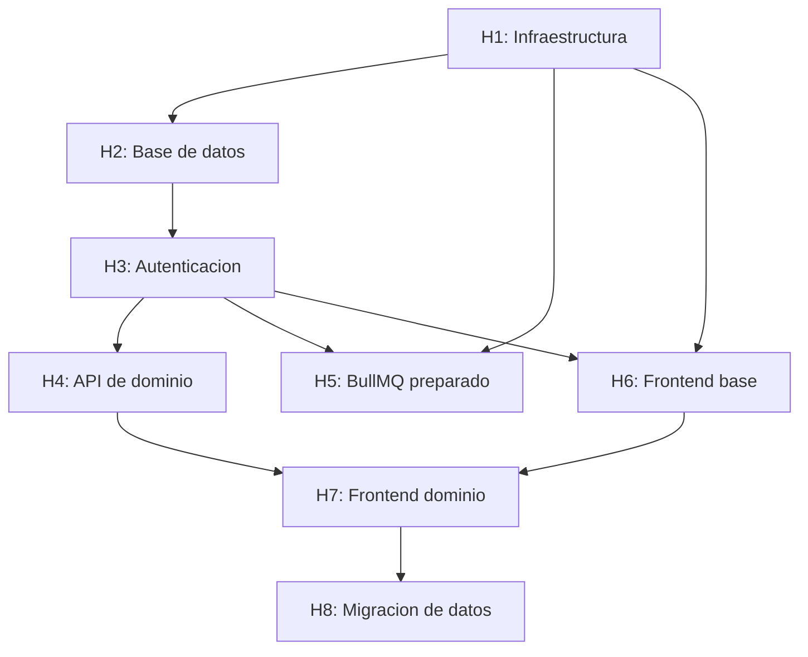

# Plan de Implementación - FS25 Farm Planner
## FS25 Farm Planner v1.0 - De prototipo IndexedDB a aplicación cliente-servidor

**Versión:** 1.0
**Fecha:** Junio 2026
**Total de Historias:** 8
**Total de Tareas:** 32
**Story Points Estimados:** 138 SP

---

## Tabla de Contenidos

1. [Resumen Ejecutivo](#resumen-ejecutivo)
2. [Estructura del Plan](#estructura-del-plan)
3. [Historias de Usuario](#historias-de-usuario)
4. [Resumen de Estimación](#resumen-de-estimación)
5. [Orden de Implementación Recomendado](#orden-de-implementación-recomendado)
6. [Dependencias Críticas](#dependencias-críticas)
7. [Riesgos y Mitigaciones](#riesgos-y-mitigaciones)
8. [Métricas de Éxito](#métricas-de-éxito)
9. [Notas Finales](#notas-finales)

---

## Resumen Ejecutivo

El prototipo `planner/` es una SPA Nuxt 4 que planifica una granja de Farming Simulator 25 (campos, establos/animales, maquinaria y calculadoras de producción) persistiendo en IndexedDB del navegador. Este plan describe su conversión en una aplicación cliente-servidor real: una API Fastify + PostgreSQL 18 multiusuario y un frontend Nuxt 4 reestructurado con Feature-Sliced Design, desplegados con Docker Compose tras un proxy nginx.

El valor: pasar de una herramienta local sin respaldo a un servicio con cuentas, múltiples partidas guardadas por usuario, catálogos del juego versionables sin redesplegar y base para funcionalidades asíncronas futuras (informes, importación de savegames) sobre BullMQ.

### Características Clave
- **Cuentas y sesiones**: registro/login JWT con refresh rotado; autorización por propiedad sin roles.
- **Partidas (farms)**: cada usuario gestiona varias partidas de FS25, cada una con su dificultad, yield bonus y precios.
- **Catálogos versionados**: cultivos, ensilajes, tipos de animales y constantes del juego como datos seed en PostgreSQL, actualizables por parche del juego.
- **Cálculo en cliente**: motor de proyecciones (cultivos y 7 especies de animales) portado al frontend, alimentado por los catálogos de la API.
- **Infraestructura preparada**: BullMQ/Redis desplegados sin jobs de negocio en v1.

### Stack Tecnológico
- **Runtime**: Node.js 22 LTS
- **Framework**: Fastify 5 (API) / Nuxt 4 + Vue 3 (web)
- **Database**: PostgreSQL 18 (PK `uuidv7()`) + Drizzle ORM
- **Cache**: Redis 7 + BullMQ (infraestructura preparada)
- **Frontend**: Pinia, Sass (SCSS), Feature-Sliced Design
- **Infra**: Docker Compose + nginx (proxy inverso y estáticos)

---

## Estructura del Plan

Este plan está organizado en **8 Historias de Usuario** principales, cada una con múltiples **Tareas Técnicas** detalladas.

| Historia | Nombre | Story Points | Tareas | Prioridad |
|----------|--------|--------------|--------|-----------|
| **H1** | Infraestructura y despliegue | 18 SP | 4 | Highest |
| **H2** | Base de datos y catálogos seed | 21 SP | 4 | Highest |
| **H3** | Autenticación y sesiones | 18 SP | 4 | Highest |
| **H4** | API de dominio (farms y recursos) | 26 SP | 6 | High |
| **H5** | BullMQ preparado | 5 SP | 2 | Low |
| **H6** | Frontend base (FSD, auth, estilos) | 18 SP | 4 | High |
| **H7** | Frontend de dominio y motor de cálculo | 26 SP | 6 | High |
| **H8** | Migración de datos desde IndexedDB | 6 SP | 2 | Medium |

---

## Historias de Usuario

---

## H1: Infraestructura y despliegue

**Tipo**: Story
**Prioridad**: Highest
**Story Points**: 18 SP

**Como** equipo de desarrollo
**Quiero** un entorno reproducible con Docker Compose (nginx, api, worker, postgres, redis)
**Para** desarrollar, probar y desplegar la aplicación de forma consistente

**Descripción**:
Montar el esqueleto de los dos proyectos (`api/`, `web/`) y la infraestructura compartida en `docker/`. nginx sirve los estáticos del frontend y hace proxy de `/api` hacia la API; Postgres y Redis quedan en una red interna sin exposición externa. Base sobre la que se construye todo lo demás.

**Criterios de Aceptación**:
- ✅ `docker compose up` levanta los 5 servicios con healthchecks en verde.
- ✅ nginx sirve un placeholder del frontend en `/` y reenvía `/api/v1/health` a la API.
- ✅ Postgres 18 y Redis no exponen puertos fuera de la red interna en el perfil de producción.
- ✅ Variables de entorno por servicio vía `.env` con `.env.example` versionado.

**Tareas Técnicas**:

---

### H1.1: Scaffolding de los proyectos `api/` y `web/`
**Tipo**: Task
**Story Points**: 5 SP

**Subtareas**:
- [ ] Inicializar `api/` (Node 22, TypeScript strict, Fastify 5, estructura por capas de `docs/arquitectura-api.md` §7).
- [ ] Inicializar `web/` (Nuxt 4 `ssr: false`, Pinia, Sass) con la estructura FSD de `docs/arquitectura-frontend.md` §7.
- [ ] Configurar ESLint + Prettier en ambos; reglas de límites de capa FSD en `web/`.
- [ ] `GET /api/v1/health` operativo y endpoint mínimo.

**Dependencias**: —

---

### H1.2: Dockerfiles multi-stage
**Tipo**: Task
**Story Points**: 4 SP

**Subtareas**:
- [ ] `api/Dockerfile` multi-stage (build TS → runtime `node:22-alpine`).
- [ ] `web/Dockerfile` que produce el build estático de Nuxt como artefacto.
- [ ] Imagen/`worker` reutilizando el build de `api/` con entrypoint distinto.

**Dependencias**: H1.1

---

### H1.3: docker-compose y red interna
**Tipo**: Task
**Story Points**: 5 SP

**Subtareas**:
- [ ] `docker/docker-compose.yml` con servicios `nginx`, `api`, `worker`, `postgres:18`, `redis:7`.
- [ ] Volúmenes persistentes para Postgres (y Redis si se habilita AOF).
- [ ] Healthchecks: `pg_isready`, `redis PING`, `GET /api/v1/health`; `nginx` depende de `api` healthy.
- [ ] Red interna; solo `nginx` publica puertos. `.env.example` con todas las variables.

**Dependencias**: H1.2

---

### H1.4: Configuración de nginx
**Tipo**: Task
**Story Points**: 4 SP

**Subtareas**:
- [ ] `docker/nginx/nginx.conf`: servir estáticos del build Nuxt con fallback SPA (`try_files ... /index.html`).
- [ ] `location /api/` → proxy a `api:PORT` con cabeceras correctas.
- [ ] Cabeceras de seguridad (`X-Content-Type-Options`, `X-Frame-Options`, CSP) y compresión gzip/brotli.
- [ ] Preparar bloque TLS comentado para despliegue con certificado.

**Dependencias**: H1.3

---

## H2: Base de datos y catálogos seed

**Tipo**: Story
**Prioridad**: Highest
**Story Points**: 21 SP

**Como** desarrollador del backend
**Quiero** el esquema PostgreSQL completo, sus migraciones y los catálogos del juego cargados como seed
**Para** disponer del modelo de datos sobre el que opera toda la API

**Descripción**:
Materializar en Drizzle las 14 tablas, 3 enums y constraints de `docs/base-de-datos.md`, con el trigger `set_updated_at()` y la extensión `citext`. Cargar como seed los 25 cultivos, 10 ensilajes, 7 tipos de animales y las constantes globales con los valores de `docs/seeds-catalogo.md` (documento autocontenido; no depende del prototipo).

**Criterios de Aceptación**:
- ✅ Las migraciones crean el esquema completo desde cero sin errores.
- ✅ Todas las PK son `uuid DEFAULT uuidv7()`; `updated_at` se actualiza por trigger.
- ✅ El seed deja una `game_version` activa con catálogos completos y validados con zod.
- ✅ Los CHECK de capacidad, rangos y unicidad funcional están presentes y probados.

**Tareas Técnicas**:

---

### H2.1: Schema Drizzle y enums
**Tipo**: Task
**Story Points**: 8 SP

**Subtareas**:
- [ ] Definir enums `difficulty`, `sell_price_type`, `animal_species`.
- [ ] Definir las 14 tablas con columnas, tipos `numeric`, FKs, índices y constraints CHECK de `docs/base-de-datos.md`.
- [ ] Tipar columnas JSONB (`monthly_rates`, `feed_options`, `inputs`, `config`, `state`, `preferences`, `value`) con tipos de Drizzle.

**Dependencias**: H1.1

---

### H2.2: Migración inicial (SQL custom)
**Tipo**: Task
**Story Points**: 4 SP

**Subtareas**:
- [ ] Configurar `drizzle.config.ts` y generar la migración inicial.
- [ ] Añadir SQL custom: `CREATE EXTENSION citext`, función + triggers `set_updated_at()` por tabla, índice único parcial `one_active_game_version`.
- [ ] Aplicar migraciones en el arranque de `api` o por comando dedicado.

**Dependencias**: H2.1

---

### H2.3: Seeds de catálogos
**Tipo**: Task
**Story Points**: 6 SP

**Subtareas**:
- [ ] Seed de `game_versions` (una activa, p. ej. `FS25 1.0`).
- [ ] Seed de `crops` (25) y `silage_crops` (10) con slugs, desde `docs/seeds-catalogo.md` §2-§3.
- [ ] Seed de `animal_types` (7): tasas mensuales, precios de venta y componentes de pienso desde `docs/seeds-catalogo.md` §4 (incluye las correcciones ya aplicadas: cabra con escalares propios, precios de venta, oveja/cabra vendibles a 1000).
- [ ] Seed de `game_constants` desde `docs/seeds-catalogo.md` §5.

**Dependencias**: H2.2

---

### H2.4: Validación de catálogo y tests de esquema
**Tipo**: Task
**Story Points**: 3 SP

**Subtareas**:
- [ ] Schemas zod para `monthly_rates`/`feed_options` por especie; el seed falla si no validan.
- [ ] Tests de integración contra Postgres real (Testcontainers/compose de test): constraints de capacidad, unicidad y cascadas.

**Dependencias**: H2.3

---

## H3: Autenticación y sesiones

**Tipo**: Story
**Prioridad**: Highest
**Story Points**: 18 SP

**Como** jugador
**Quiero** registrarme, iniciar sesión y mantener la sesión de forma segura
**Para** acceder a mis partidas desde cualquier navegador

**Descripción**:
Implementar el módulo de identidad: registro (creando user + user_settings + farm por defecto), login, rotación de refresh tokens con detección de reuso, logout y perfil. Plugin de autenticación JWT y rate-limit en endpoints sensibles.

**Criterios de Aceptación**:
- ✅ El registro crea automáticamente las preferencias y una farm "Mi partida".
- ✅ Access token ~15 min; refresh opaco ~30 días, solo hash en BD, rotado en cada uso.
- ✅ Reuso de un refresh rotado revoca toda la cadena (`401 REFRESH_TOKEN_REUSED`).
- ✅ `login`/`register` con rate-limit (`429`); contraseñas con argon2id.

**Tareas Técnicas**:

---

### H3.1: Plugin de autenticación y manejo de errores
**Tipo**: Task
**Story Points**: 5 SP

**Subtareas**:
- [ ] `@fastify/jwt`, plugin `auth` que decora `request.user`; lista blanca (register/login/refresh/health).
- [ ] Error handler global: zod → `422 VALIDATION_ERROR`, errores de dominio tipados, `500` sin filtrar internos.
- [ ] Envelope `{data, meta}` y `{error}` centralizado.

**Dependencias**: H2.2

---

### H3.2: Registro, login y perfil
**Tipo**: Task
**Story Points**: 5 SP

**Subtareas**:
- [ ] `POST /auth/register` (transacción: user + user_settings + farm por defecto), argon2id.
- [ ] `POST /auth/login`, `GET /auth/me`, `PATCH /auth/me` (cambio de displayName/contraseña).
- [ ] Schemas zod de request/response según `docs/openapi.yaml`.

**Dependencias**: H3.1

---

### H3.3: Refresh tokens con rotación
**Tipo**: Task
**Story Points**: 5 SP

**Subtareas**:
- [ ] `POST /auth/refresh`: validar hash, rotar (`replaced_by_id`), emitir par nuevo.
- [ ] Detección de reuso: token rotado/revocado → revocar cadena → `401 REFRESH_TOKEN_REUSED`.
- [ ] `POST /auth/logout` idempotente.

**Dependencias**: H3.2

---

### H3.4: Rate limiting y tests de auth
**Tipo**: Task
**Story Points**: 3 SP

**Subtareas**:
- [ ] `@fastify/rate-limit` en `login`/`register`.
- [ ] Tests: ciclo completo, expiración, reuso de refresh, acceso sin token.

**Dependencias**: H3.3

---

## H4: API de dominio (farms y recursos)

**Tipo**: Story
**Prioridad**: High
**Story Points**: 26 SP

**Como** jugador autenticado
**Quiero** gestionar mis partidas, campos, establos, maquinaria y configuraciones de calculadora
**Para** planificar mi granja con mis datos persistidos en el servidor

**Descripción**:
Implementar el CRUD completo del dominio bajo `/farms/:farmId/...`, el plugin `farm-scope` que garantiza propiedad, los catálogos read-only y las preferencias de usuario. Incluye las reglas de negocio: coherencia cultivo↔versión, remapeo por slug al cambiar versión, upsert de configs y validación JSONB por especie.

**Criterios de Aceptación**:
- ✅ Todo recurso anidado se filtra por `farm_id` + `user_id`; acceso ajeno → `404`.
- ✅ `CROP_VERSION_MISMATCH`, `COUNT_EXCEEDS_CAPACITY` y duplicados devuelven sus códigos.
- ✅ `PUT /animal-configs/:species` valida `inputs` con unión discriminada zod y hace upsert.
- ✅ Catálogos servidos con `ETag`/`Cache-Control`; Swagger UI disponible.

**Tareas Técnicas**:

---

### H4.1: Plugin `farm-scope` y catálogos
**Tipo**: Task
**Story Points**: 5 SP

**Subtareas**:
- [ ] Plugin `farm-scope`: resuelve y valida la farm (`request.farm`), `404` si no es del usuario.
- [ ] `GET /catalog/*` (game-versions, crops, silage-crops, animal-types, constants) con `?gameVersionId`, ETag y cache.
- [ ] `@fastify/swagger` + UI sirviendo el contrato.

**Dependencias**: H3.1

---

### H4.2: Farms CRUD
**Tipo**: Task
**Story Points**: 5 SP

**Subtareas**:
- [ ] CRUD de `/farms` con unicidad `(user_id, name)` (`409 DUPLICATE_FARM_NAME`).
- [ ] Cambio de `gameVersionId`: remapeo de `fields.crop_id` por slug en transacción; warnings en `meta`.
- [ ] `DELETE` con cascada.

**Dependencias**: H4.1

---

### H4.3: Fields CRUD
**Tipo**: Task
**Story Points**: 5 SP

**Subtareas**:
- [ ] CRUD bajo `/farms/:farmId/fields` con unicidad `(farm_id, field_number)`.
- [ ] Validación de coherencia `crop_id`↔versión (`422 CROP_VERSION_MISMATCH`) y `is_silage` (`SILAGE_NOT_SUPPORTED_FOR_CROP`).

**Dependencias**: H4.2

---

### H4.4: Stables y Machinery CRUD
**Tipo**: Task
**Story Points**: 5 SP

**Subtareas**:
- [ ] CRUD de stables: unicidad de nombre, `COUNT_EXCEEDS_CAPACITY`, validación zod de `config` por especie.
- [ ] CRUD de machinery (sin unicidad de nombre).

**Dependencias**: H4.2

---

### H4.5: Animal configs y calculator states
**Tipo**: Task
**Story Points**: 4 SP

**Subtareas**:
- [ ] `GET` lista, `GET/PUT(upsert)/DELETE /animal-configs/:species` con unión discriminada zod; rechazar `difficulty`/`sellPriceType` en `inputs`.
- [ ] `GET/PUT /calculator-states/:toolKey` (`work_speed`) con validación por `tool_key`.

**Dependencias**: H4.4

---

### H4.6: User settings y tests de dominio
**Tipo**: Task
**Story Points**: 2 SP

**Subtareas**:
- [ ] `GET/PATCH /me/settings` (crea con defaults; `FARM_NOT_OWNED` si `activeFarmId` ajeno).
- [ ] Tests de acceso cruzado entre dos usuarios (todos deben dar `404`).

**Dependencias**: H4.5

---

## H5: BullMQ preparado

**Tipo**: Story
**Prioridad**: Low
**Story Points**: 5 SP

**Como** equipo de desarrollo
**Quiero** la infraestructura de colas lista pero sin jobs de negocio
**Para** poder añadir trabajos asíncronos en el futuro sin tocar despliegue ni arranque

**Descripción**:
Conectar el contenedor `worker` a Redis con BullMQ, dejar una cola base y el esqueleto de procesador. Único job opcional permitido: limpieza periódica de refresh tokens expirados.

**Criterios de Aceptación**:
- ✅ El worker arranca, conecta a Redis y queda a la espera sin procesar nada en v1.
- ✅ La conexión y la definición de cola son reutilizables desde la API (productor) y el worker (consumidor).

**Tareas Técnicas**:

---

### H5.1: Conexión Redis y cola base
**Tipo**: Task
**Story Points**: 3 SP

**Subtareas**:
- [ ] Módulo de conexión Redis compartido y definición de cola base en `api/src/queues/`.
- [ ] Entrypoint del worker que registra el procesador esqueleto.

**Dependencias**: H1.3

---

### H5.2: Job opcional de limpieza de tokens
**Tipo**: Task
**Story Points**: 2 SP

**Subtareas**:
- [ ] Job (repetible) que borra `refresh_tokens` con `expires_at` vencido (deshabilitado por flag de entorno por defecto).

**Dependencias**: H5.1, H3.3

---

## H6: Frontend base (FSD, auth, estilos)

**Tipo**: Story
**Prioridad**: High
**Story Points**: 18 SP

**Como** jugador
**Quiero** una interfaz donde registrarme/iniciar sesión y navegar
**Para** empezar a usar la aplicación con mi cuenta

**Descripción**:
Montar las capas FSD, el cliente HTTP con refresh automático, las pantallas de auth, el guard de router y la migración del tema glassmorphism a SCSS con tokens. Base del frontend antes de portar las páginas de dominio.

**Criterios de Aceptación**:
- ✅ Login/registro funcionando contra la API con manejo de errores por campo.
- ✅ El cliente HTTP refresca el access token de forma transparente ante `TOKEN_EXPIRED`.
- ✅ El guard impide acceder a rutas privadas sin sesión.
- ✅ Tokens de diseño (colores, sombras, glass) en SCSS reutilizados por el ui-kit.

**Tareas Técnicas**:

---

### H6.1: Capas FSD y configuración Nuxt
**Tipo**: Task
**Story Points**: 4 SP

**Subtareas**:
- [ ] Alias de capas (`~/widgets`, `~/features`, `~/entities`, `~/shared`) y reglas de import.
- [ ] Providers (Pinia), layout base con `widgets/app-sidebar`.

**Dependencias**: H1.1

---

### H6.2: Cliente HTTP y store de sesión
**Tipo**: Task
**Story Points**: 6 SP

**Subtareas**:
- [ ] `shared/api`: wrapper de `$fetch` que añade `Authorization`, desenvuelve `{data, meta}`, normaliza errores.
- [ ] Refresh automático ante `401 TOKEN_EXPIRED` con cola de peticiones en vuelo; logout si falla.
- [ ] `entities/user`: store de sesión (access en memoria, refresh en localStorage).

**Dependencias**: H6.1, H3.3

---

### H6.3: Pantallas de auth y guard
**Tipo**: Task
**Story Points**: 5 SP

**Subtareas**:
- [ ] `pages/login.vue`, `pages/register.vue` con `features/auth`.
- [ ] Middleware de router: rutas privadas requieren sesión.

**Dependencias**: H6.2

---

### H6.4: Migración de estilos a SCSS
**Tipo**: Task
**Story Points**: 3 SP

**Subtareas**:
- [ ] Portar `planner/app/assets/css/main.css` a `app/styles` (`_variables.scss`, `_mixins.scss`, `main.scss`).
- [ ] ui-kit base en `shared/ui` (GlassCard, StatCard, DataTable, inputs).

**Dependencias**: H6.1

---

## H7: Frontend de dominio y motor de cálculo

**Tipo**: Story
**Prioridad**: High
**Story Points**: 26 SP

**Como** jugador
**Quiero** las páginas de planificación (dashboard, campos, establos, maquinaria, calculadoras)
**Para** planificar mi granja con cálculos instantáneos sobre mis datos del servidor

**Descripción**:
Portar las 12 vistas del prototipo a FSD consumiendo la API, con el catálogo cacheado en `entities/catalog`, el selector de partida activa y el motor de cálculo parametrizado en `shared/lib/engine`. El estado del prototipo (configs de calculadora, estado de speed-calculator) se persiste vía API.

**Criterios de Aceptación**:
- ✅ Las proyecciones de cultivos y de las 7 especies coinciden con las del prototipo (dentro de tolerancia numérica).
- ✅ El catálogo se carga una vez por sesión/versión y alimenta el motor; no quedan constantes hardcodeadas.
- ✅ Crear/editar/borrar campos, establos y maquinaria persiste contra la API.
- ✅ El usuario puede crear/seleccionar partidas y cambiar entre ellas.

**Tareas Técnicas**:

---

### H7.1: Store de catálogo y motor de cálculo
**Tipo**: Task
**Story Points**: 6 SP

**Subtareas**:
- [ ] `entities/catalog`: carga y cachea catálogos de la versión de la farm activa.
- [ ] Portar `cropCalculations.ts` y `animalCalculations.ts` a `shared/lib/engine` como funciones puras `f(catálogo, contextoFarm, inputs)`; eliminar `cropTranslationMap` (usar slugs).
- [ ] Tests del motor comparando con valores del prototipo (tolerancias).

**Dependencias**: H4.1, H6.2

---

### H7.2: Selector de partida y dashboard
**Tipo**: Task
**Story Points**: 5 SP

**Subtareas**:
- [ ] `features/farm-switcher` (CRUD de farms + farm activa en `user_settings.active_farm_id`).
- [ ] `pages/index.vue` + `widgets/farm-summary` (KPIs, distribución de cultivos, resumen económico).

**Dependencias**: H7.1

---

### H7.3: Gestión de campos
**Tipo**: Task
**Story Points**: 5 SP

**Subtareas**:
- [ ] `entities/field`, `features/field-manage`, `widgets/crop-comparison-table`.
- [ ] Comparativa de cultivos con ingresos por dificultad y "sembrar".

**Dependencias**: H7.1

---

### H7.4: Establos y maquinaria
**Tipo**: Task
**Story Points**: 4 SP

**Subtareas**:
- [ ] `entities/stable` + `features/stable-manage` (resumen consolidado por especie).
- [ ] `entities/machinery` + `features/machinery-manage`.

**Dependencias**: H7.1

---

### H7.5: Calculadoras de animales
**Tipo**: Task
**Story Points**: 4 SP

**Subtareas**:
- [ ] `widgets/animal-calculator-panels` (inputs/producción/fieldwork) para las 7 especies.
- [ ] `features/calculator-config`: persistir/cargar configs en `/animal-configs/:species`; vincular establo.

**Dependencias**: H7.4

---

### H7.6: Calculadora de tiempo de trabajo
**Tipo**: Task
**Story Points**: 2 SP

**Subtareas**:
- [ ] `pages/speed-calculator.vue` referenciando máquinas por UUID; persistir estado en `/calculator-states/work_speed`.

**Dependencias**: H7.4

---

## H8: Migración de datos desde IndexedDB

**Tipo**: Story
**Prioridad**: Medium
**Story Points**: 6 SP

**Como** usuario del prototipo
**Quiero** trasladar mis datos de IndexedDB a mi cuenta nueva
**Para** no perder mi planificación al migrar a la aplicación real

**Descripción**:
Utilidad que exporta el contenido de IndexedDB del prototipo y lo importa contra la API normal, resolviendo nombres de cultivo en español → slug y mapeando settings globales a la farm.

**Criterios de Aceptación**:
- ✅ Exporta fields, establos, maquinaria y configs del prototipo a un JSON.
- ✅ Importa creando una farm con la dificultad/yieldBonus/sellPrice del prototipo y sus recursos.
- ✅ Cultivos no resolubles se reportan, no rompen la importación.

**Tareas Técnicas**:

---

### H8.1: Export desde IndexedDB
**Tipo**: Task
**Story Points**: 2 SP

**Subtareas**:
- [ ] Script/página en el prototipo que serializa los stores `fields` y `settings` a JSON descargable.

**Dependencias**: —

---

### H8.2: Import contra la API
**Tipo**: Task
**Story Points**: 4 SP

**Subtareas**:
- [ ] Utilidad en `web/` que crea farm + recursos vía API a partir del JSON.
- [ ] Resolución nombre español → slug (mapa puntual); reporte de cultivos no resueltos.

**Dependencias**: H8.1, H7.3

---

## Resumen de Estimación

### Por Historia

| Historia | Story Points | % del Total | Tareas |
|----------|--------------|-------------|--------|
| H1 - Infraestructura | 18 SP | 13.0% | 4 |
| H2 - Base de datos | 21 SP | 15.2% | 4 |
| H3 - Autenticación | 18 SP | 13.0% | 4 |
| H4 - API de dominio | 26 SP | 18.8% | 6 |
| H5 - BullMQ preparado | 5 SP | 3.6% | 2 |
| H6 - Frontend base | 18 SP | 13.0% | 4 |
| H7 - Frontend dominio | 26 SP | 18.8% | 6 |
| H8 - Migración de datos | 6 SP | 4.3% | 2 |
| **TOTAL** | **138 SP** | **100%** | **32** |

### Por Prioridad

| Prioridad | Story Points | Historias | % del Total |
|-----------|--------------|-----------|-------------|
| Highest | 57 SP | 3 | 41.3% |
| High | 70 SP | 3 | 50.7% |
| Medium | 6 SP | 1 | 4.3% |
| Low | 5 SP | 1 | 3.6% |

### Estimación de Tiempo

Asumiendo velocidad de equipo de **30 SP por sprint (2 semanas)**:

- **Sprints necesarios**: ~5 sprints
- **Duración estimada**: ~10 semanas (~2.5 meses)
- **Con 1 desarrollador**: ~10 semanas (~2.5 meses)
- **Con 2 desarrolladores**: ~6 semanas (~1.5 meses), paralelizando API y frontend tras H2

---

## Orden de Implementación Recomendado

### Sprint 1: Cimientos (30 SP)
1. H1: Infraestructura y despliegue (18 SP)
2. H2.1 + H2.2: Schema y migración inicial (12 SP)

### Sprint 2: Datos y auth (30 SP)
3. H2.3 + H2.4: Seeds y validación (9 SP)
4. H3: Autenticación y sesiones (18 SP)
5. H5.1: Conexión Redis y cola base (3 SP) - en paralelo

### Sprint 3: API de dominio (28 SP)
6. H4: API de dominio (26 SP)
7. H5.2: Job de limpieza de tokens (2 SP)

### Sprint 4: Frontend base (28 SP)
8. H6: Frontend base (18 SP)
9. H7.1: Catálogo y motor de cálculo (6 SP)
10. H7.2: Selector de partida y dashboard (inicio, 4 SP)

### Sprint 5: Frontend de dominio y migración (22 SP)
11. H7.2 (cierre) + H7.3 + H7.4 + H7.5 + H7.6 (resto de H7)
12. H8: Migración de datos (6 SP)

---

## Dependencias Críticas

**Notas sobre Dependencias**:
- Camino crítico: H1 → H2 → H3 → H4 → H7. El frontend de dominio depende tanto de la API de dominio como del frontend base.
- Cuello de botella: H2 (esquema + seeds) bloquea auth y todo el dominio; priorizarla.
- Paralelización: tras H3, el frontend base (H6) avanza en paralelo a la API de dominio (H4); H5 es independiente y de baja prioridad.

---

## Riesgos y Mitigaciones

### Riesgos Técnicos

| Riesgo | Probabilidad | Impacto | Mitigación |
|--------|--------------|---------|------------|
| Divergencia del motor de cálculo respecto al prototipo al portarlo | Media | Alto | Tests del motor comparando con valores conocidos del prototipo (tolerancias); portar fórmulas, no reescribirlas |
| Errores al transcribir los seeds a código | Baja | Alto | Valores ya consolidados y verificados en `docs/seeds-catalogo.md` (incluye correcciones: Goat, precios de venta, oveja/cabra 1000, 5.244); validar seeds con zod contra ese documento |
| Validación JSONB insuficiente permite datos corruptos | Media | Medio | zod obligatorio en todo JSONB de usuario; `schema_version` para migración perezosa |
| Coherencia cultivo↔versión rota al cambiar `gameVersionId` | Baja | Medio | Remapeo por slug en transacción con warnings; tests del flujo de cambio de versión |
| Olvido del scoping de propiedad en un handler nuevo | Media | Crítico | Plugin `farm-scope` obligatorio; tests de acceso cruzado entre usuarios |
| Precisión numérica float vs numeric en proyecciones | Baja | Bajo | Comparaciones con tolerancia, nunca igualdad estricta; documentado |

### Riesgos de Seguridad

| Riesgo | Probabilidad | Impacto | Mitigación |
|--------|--------------|---------|------------|
| Robo de refresh token (XSS, localStorage) | Baja | Alto | CSP estricta, sin render de HTML externo, rotación con detección de reuso y revocación de cadena |
| Enumeración de recursos ajenos | Baja | Medio | UUID v7 no adivinable + respuesta `404` uniforme para ownership |
| Fuerza bruta en login | Media | Medio | Rate-limit en `login`/`register`; argon2id |

### Riesgos de Despliegue

| Riesgo | Probabilidad | Impacto | Mitigación |
|--------|--------------|---------|------------|
| Dependencia de PostgreSQL 18 (uuidv7 nativo) | Baja | Medio | Fijar `postgres:18` en compose; documentado como requisito |
| Estáticos del frontend desincronizados del contrato de la API | Media | Medio | OpenAPI como fuente de verdad; generar tipos del contrato en `web/` |

---

## Métricas de Éxito

### Métricas Técnicas
- **Cobertura de tests**: ≥ 80% en services del backend y en el motor de cálculo.
- **Validez del contrato**: `redocly lint docs/openapi.yaml` sin errores.
- **Arranque reproducible**: `docker compose up` levanta el sistema con healthchecks en verde en < 60 s.
- **Tiempo de respuesta API**: p95 < 200 ms en CRUD de dominio (volúmenes pequeños).

### Métricas de Negocio
- **Paridad funcional**: las 12 vistas del prototipo operativas contra la API.
- **Migración**: el 100% de los datos exportables del prototipo se importan correctamente (o se reportan los no resolubles).
- **Multi-partida**: un usuario puede crear y alternar entre varias partidas.

### Métricas de Calidad
- **Paridad de cálculo**: proyecciones idénticas al prototipo dentro de tolerancia (1e-6 relativo).
- **Sin constantes hardcodeadas**: el motor del frontend no contiene datos de balance; todo viene del catálogo.

---

## Notas Finales

### Convenciones de Código
- TypeScript strict en API y web; sin `any` salvo justificación.
- Estilo: ESLint + Prettier; en `web/`, reglas de límites de capa FSD.
- Branching: trunk-based con ramas de feature por historia/tarea; PR con revisión.
- Commits siguiendo la convención del repositorio.

### Herramientas Recomendadas
- **Backend**: Fastify 5, Drizzle ORM, drizzle-kit, zod, @fastify/jwt, argon2, BullMQ.
- **Frontend**: Nuxt 4, Pinia, Sass, ofetch.
- **Testing**: Vitest, Testcontainers (o compose de test), @vue/test-utils.
- **Infra**: Docker Compose, nginx.

### Documentación Adicional
- **Arquitectura API**: `docs/arquitectura-api.md`
- **Arquitectura Frontend**: `docs/arquitectura-frontend.md`
- **Base de datos**: `docs/base-de-datos.md`
- **Catálogo de seeds**: `docs/seeds-catalogo.md`
- **Autorización**: `docs/autorizacion-api.md`
- **Contrato API**: `docs/openapi.yaml`

### Enlaces Útiles
- Repositorio del Proyecto: `fs25-tools`
- Prototipo de referencia: `planner/`
- Plantillas de documentación: `docs/plantillas/`

---

**Fin del Documento**
